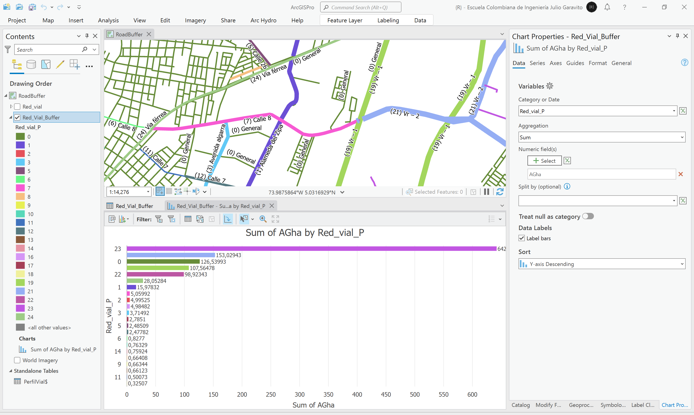
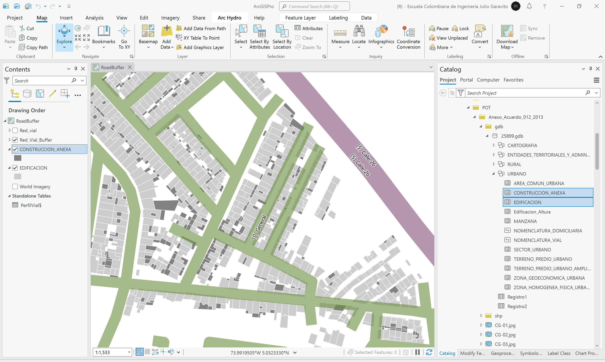
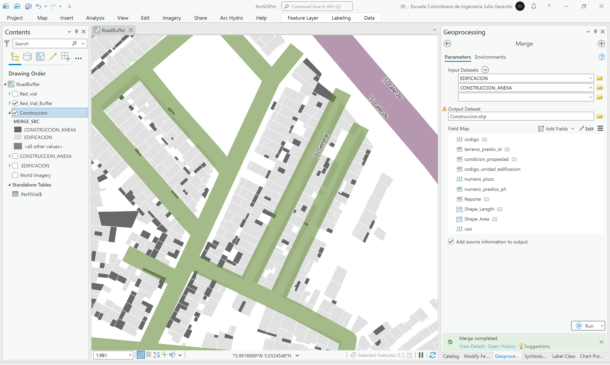
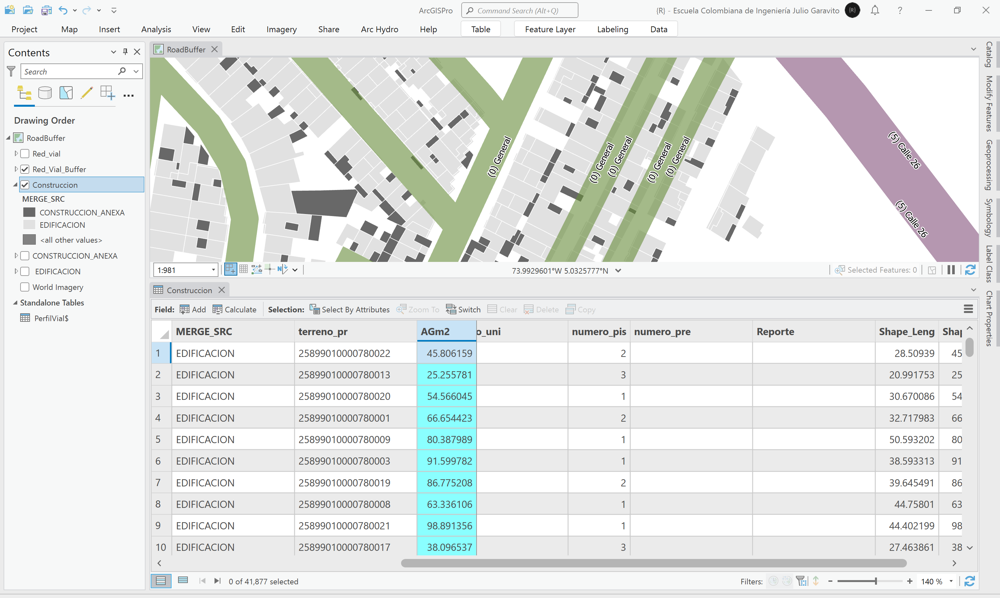
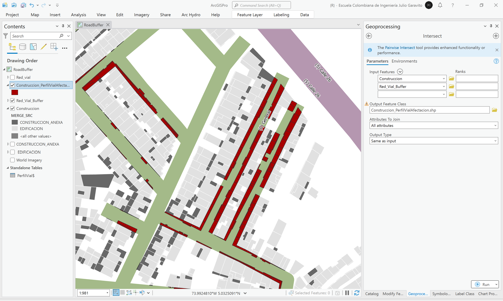
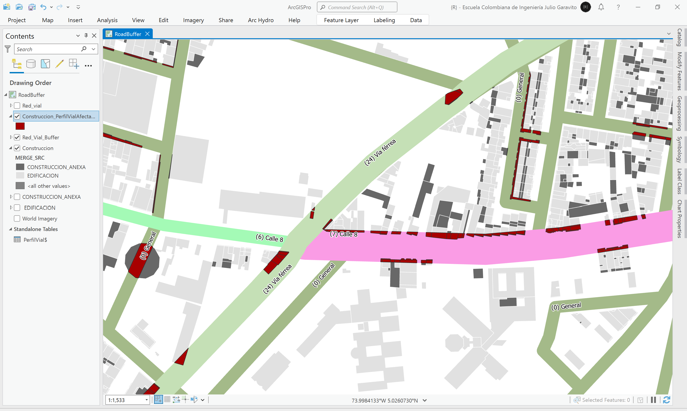
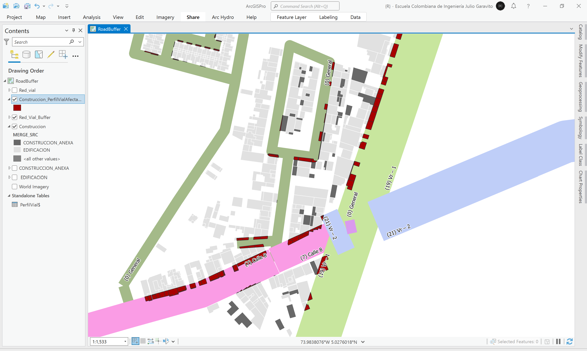
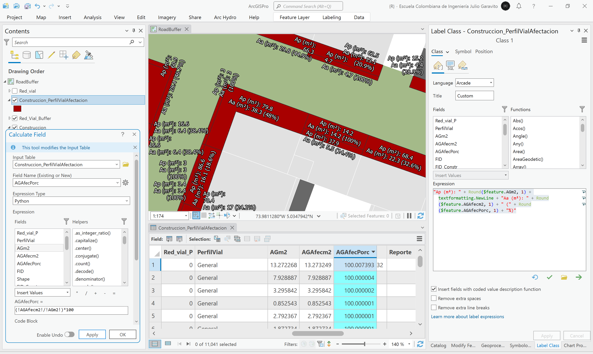
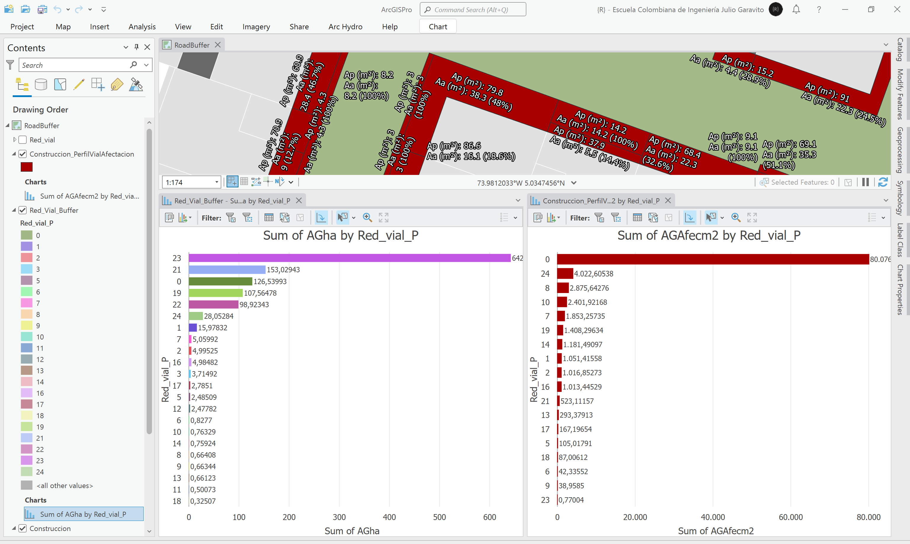

# 3.2. Corredores viales urbanos y construcciones afectadas
Keywords: `road-buffer` `rail-buffer` `intersect`

A partir de la capa de vías urbanas, sus jerarquías, y siguiendo las especificaciones de perfiles viales establecidas en el POT, cree las áreas aferentes o corredores viales. A partir de los buffers de vía generados y las construcciones disponibles en la cartografía del POT, realice una intersección e identifique las construcciones afectadas. Cree un reporte indicando el área total de la construcción, el área afectada, % de afectación y el corredor víal de la afectación.

## Objetivos

* Asociar a los ejes viales, los anchos de los corredores definidos en el POT.
* Generar áreas aferentes alrededor de los ejes viales, identificando construcciones afectadas en la implantación de proyectos de renovación vial.

## Requerimientos

* [:mortar_board:Actividad](../POTLayer/Readme.md): Inventario de información geo-espacial recopilada del POT y diccionario de datos.
* [:mortar_board:Actividad](../RoadSummary/Readme.md): Análisis estadístico de la red vial.
* [:notebook:Lectura](https://edu.gcfglobal.org/es/estadistica-basica/): Conocimientos básicos en estadística.
* [:toolbox:Herramienta](https://www.esri.com/en-us/arcgis/products/arcgis-pro/overview): ESRI ArcGIS Pro 3.3.1 o superior.
* [:toolbox:Herramienta](https://qgis.org/): QGIS 3.38 o superior.
* [:open_file_folder:RoadBuffer.xlsx](RoadBuffer.xlsx): libro con especificaciones de perfiles viales.

## 1. Creación de tabla de perfiles viales

> En las vías rurales, aplican los perfiles que se presentan en el siguiente cuadro, de conformidad con lo regulado por la Ley 1228 de 2008 en materia de franjas de retiro.
> 
> En cuanto a las vías urbanas que no son de carácter departamental o nacional, sus especificaciones son definidas directamente en el POT.

Siguiendo las especificaciones de perfiles viales establecidas en los Artículos 48 y 110 del POT, cree una tabla detallada en Excel denominada [RoadBuffer.xlsx](RoadBuffer.xlsx), que contenga las siguientes columnas:

| Columna    | Descripción                                                                                                                                               | Urbano y Expansión | Rural |
|------------|-----------------------------------------------------------------------------------------------------------------------------------------------------------|:------------------:|:-----:|
| PerfilNum  | Código consecutivo de perfil. De 0 a n. PerfiNum = 0, es utilizado para aplicar un perfil genérico a las vías urbanas sin perfil específicamente definido. |         ✓          |   ✓   |
| Zona       | Zona de aplicación: Urbano y expansión urbana, Rural.                                                                                                     |         ✓          |   ✓   |
| ViaTipo    | Descripción de la vía o nomenclatura al cual aplica el perfil vial.                                                                                       |         ✓          |   ✓   |
| Jerarquia  | Jerarquía vial. En vías urbanas corresponde a local, arterial o zonal. En vías rurales, corresponde al orden vial.                                        |         ✓          |   ✓   |
| Definicion | Definición detallada del corredor.                                                                                                                        |         ✓          |   ✓   |
| Descripc   | Descripción detallada del tramo al cual aplica.                                                                                                           |         ✓          |   ✓   |
| ZVerdeIzq  | Ancho de zona verde al lado izquierdo del perfil en metros.                                                                                               |                    |   ✓   |
| BermaCIzq  | Ancho de berma + cuneta al lado izquierdo del perfil en metros.                                                                                           |                    |   ✓   |
| AndenIzq   | Ancho del andén al lado izquierdo del perfil en metros.                                                                                                   |         ✓          |       |
| CalzadaIzq | Ancho de calzada o sub-calzada al lado izquierdo del perfil en metros.                                                                                    |         ✓          |   ✓   |
| Separador  | Ancho de separador central en metros.                                                                                                           |         ✓          |   ✓   |
| CalzadaDer | Ancho de calzada o sub-calzada al lado derecho del perfil en metros.                                                                                      |         ✓          |   ✓   |
| Cicloruta  | Ancho de cicloruta al lado derecho del perfil en metros.                                                                                                  |         ✓          |       |
| AndenDer   | Ancho del andén al lado derecho del perfil en metros.                                                                                                     |         ✓          |       |
| BermaCDer  | Ancho de berma + cuneta al lado derecho del perfil en metros.                                                                                             |                    |   ✓   |
| ZVerdeDer  | Ancho de zona verde al lado derecho del perfil en metros.                                                                                                 |                    |   ✓   |
| PerfilTot  | Ancho total del perfil en metros.                                                                                                                         |         ✓          |   ✓   |
| BufferGIS  | Ancho del buffer geográfico en metros. `BufferGIS =  PerfilTot / 2`                                                                                       |         ✓          |   ✓   |

## 2. Homologación de vías rurales

1. Abra el proyecto de ArcGIS Pro, creado previamente y desde el menú _Insert_ cree un nuevo mapa _New Map_, renombre como _RoadBuffer_ y establezca el CRS 9377. Agregue al mapa la capa vías municipales creada en la actividad [Análisis estadístico de la red vial](../RoadSummary/Readme.md), desde la ruta `\file\data\shp\Red_vial.shp`, ajuste la simbología a valores únicos representando el campo de atributos `TIPO_FOR` y rotule a partir del nombre de la vía.  

2. En la tabla de atributos de la capa de la red vial, cree un campo numérico entero corto (short) con el nombre `PerfilNum`. Luego, utilizando la herramienta de selección por atributos, seleccione todas las vías rurales cuyo orden sea 1 y con el calculador de campo establezca el código de perfil número 19.

Repita el procedimiento anterior para las demás vías rurales y los órdenes viales 2 a 4. Modifique el rótulo incluyendo entre paréntesis, el código de perfil asignado.

Rótulo Arcade: `"(" + $feature.PerfilNum + ") " +$feature.NombreVia`

Para la vía rural proyectada de orden 1 (`ZonaNombre = 'Rural' And ORDEN_VIAL = 'Primer Orden-Via Proyectada'`), aplique el código 19.

3. Para la vía férrea, establezca el código 24, correspondiente a este corredor. 

> Para las vías férreas y de conformidad con lo dispuesto en el artículo 3 de la Ley 76 de 1929, en una franja de 20 metros cuyo centro es el eje de la vía, no es posible realizar excavaciones, construcciones u otras obras que comprometan la estabilidad de la vía.
> 
> En la tabla de Excel, las vías férreas se han incluído como parte de los corredores rurales y su ancho se ha sido definido en la columna `Separador`. 

4. Para las vías rurales proyectadas, establezca el código 23, correspondiente a vías de cuarto orden.

## 3. Homologación de vías urbanas

1. Para las vías urbanas, realice selecciones por atributos para cada perfil definido en el POT y aplique el código correspondiente. Por ejemplo, para la _Alameda del Zipa_, el código a aplicar es `PerfilNum = 1`. Repita este procedimiento para las demás vías.

> La Avenida Algarra contiene dos perfiles diferentes y desde calle 8 hasta su terminación, no ha sido incluída en la capa de vías del POT.

2. En cuanto a la Calle 8, esta ha sido definida a partir de dos perfiles diferentes, entre la carrera 5 y vía férrea, y entre vía férrea carrera 36. Los vectores encontrados no están segmentados hasta el límite de la vía férrea, por lo que deberá utilizar las herramientas de edición _Explode_ para separar entidades multiparte, _Merge_ para unir los tramos de cada lado de la vía férrea y _Split_ para segmentar la vía en la vía férrea.

Calle 8 inicial  

Calle 8, editada y ajustada  

> Para vías con varios perfiles definidos, edite y ajuste los tramos requeridos para asignar los códigos correspondientes.

3. Una vez finalizada la asociación de código de perfil y editados e integrados los tramos, guarde los cambios realizados en la capa, y recalcule las longitudes contenidas en el campo `LGkm`.

4. Cree una gráfica de barras con la longitud total de vías asociadas por cada código homologado en `PerfilNum`. Simbolice la red vial a partir de los códigos asignados. Podrá observar que los códigos 4, 15 y 20, no tienen vectores asociados debido a que no se encontraban digitalizados o caracterizados en la red víal. También podrá observar que el código 23, correspondiente a vías de cuarto orden, contiene la mayor longitud de tramos, seguido del código 0, correspondiente a vías urbanas sin perfil específico definido.  

## 4. Creación de buffers

1. Agregue al mapa la tabla de Excel _RoadBuffer.xlsx_, que contiene la descripción detallada de cada perfil. Abra la tabla y verifique que estén todos los registros de perfiles creados.

2. Utilizando el campo `PerfilNum`, cree una unión o _Join_ entre la capa de vías y la tabla de Excel.

3. Abra la tabla de atributos de la capa de vías y asegúrese que para todos los registros, se encuentran asociados los valores de los perfiles establecidos, verifique el campo `BufferGIS`.

4. Desde el panel _Geoprocessing_, ejecute la herramienta _Analysis Tools / Buffer_, utilice los parámetros mostrados en la siguiente imagen, nombre la capa como `\file\data\shp\Red_Vial_Buffer.shp` y rotule utilizando el campo PerfilVial

Rótulo Arcade: `"(" + $feature.Red_vial_P + ") " + $feature.PerfilVial`

> Tenga en cuenta que la disolución de los buffers, deberá ser realizada utilizando los campos `PerfilNum` y `ViaTipo`. De esta forma podrá identificar la afectación sobre la construcción y conocer cuál perfil y vía lo generó.  

5. En la capa buffer, cree un campo de atributos numérico doble, con el nombre `AGha` y calcule el área geodésica. Simbolice a partir del tipo de perfil. Luego, cree una gráfica que permita validar el área total de corredores viales por cada tipo de perfil.

Para continuar, remueva la unión realizada sobre la capa de vías a partir del archivo de Excel.

## 5. Identificación y evaluación de construcciones afectadas

1. Desde la ruta `\file\data\POT\Anexo_Acuerdo_012_2013\gdb\25899.gdb\URBANO\`, agregue al mapa las clases de entidad _EDIFICACION_ y _CONSTRUCCION_ANEXA_ que contienen los polígonos de las edificaciones urbanas y las construcciones anexadas. Ajuste la simbología y establezca transparencia del 40% en la capa de aferencias viales.

> Para este ejercicio de clase, no utilizaremos las construcciones rurales, sin embargo, para su caso de estudio, todas las edificaciones del municipio, deberán ser incorporadas en el análisis. 

2. Utilizando la herramienta de geo-procesamiento _Data Management Tools / Merge_, integre las dos capas de construcciones en una única capa, nombre la capa integrada como `\file\data\shp\Construccion.shp`. Asegúrese de marcar la casilla _Add source information to output_, para conocer la capa fuente a partir de la cual se obtuvo cada construcción. Simbolice por valores únicos a partir del campo `MERGE_SRC`.

3. Agregue a la capa _Construccion_, un campo de atributos numérico doble con el nombre `AGm2` y calcule el área geodésica de cada elemento. Podrá observar que en la tabla de atributos se han calculado las áreas de 41887 construcciones.

4. Utilizando la herramienta de geo-procesamiento _Analysis Tools / Intersect_, genere la intersección espacial entre las construcciones y los corredores viales. Nombre la capa como `\file\data\shp\Construccion_PerfilVialAfectacion.shp`. simbolice el resultado en color rojo. Podrá observar que múltiples construcciones se encuentran dentro de los corredores definidos.

5. Para conocer el área y porcentaje afectado en cada construcción, en la capa _Construccion_PerfilVialAfectacion_, cree dos campos numéricos dobles con los nombres `AGAfecm2` y `AGAfecPorc`, calculé el área geodésica de cada fracción y para el porcentaje, divida el valor de los campos `AGm2` y `AGAfecm2`. Rotule cada área afectada incluyendo el área original, el área afectada y su porcentaje.

Rótulo Arcade: `"Ap (m²): " + Round($feature.AGm2, 1) + textformatting.NewLine + "Aa (m²): " + Round($feature.AGAfecm2, 1) + " (" + Round($feature.AGAfecPorc, 1) + "%)"`

6. Cree una gráfica que muestre el total de las áreas afectadas por cada tipo de perfil y compare con el gráfico del total de áreas por perfil.

## 6. Análisis usando software libre - QGIS

Para el desarrollo de las actividades desarrolladas en esta clase, se pueden utilizar en QGIS las siguientes herramientas o geo-procesos:

| Proceso                          | Procedimiento                                                                                                                                                                                                                                                                                                                                                                    |
|:---------------------------------|:---------------------------------------------------------------------------------------------------------------------------------------------------------------------------------------------------------------------------------------------------------------------------------------------------------------------------------------------------------------------------------|
| Simbología                       | Modificable desde las propiedades de la capa en la pestaña _Symbology_.                                                                                                                                                                                                                                                                                                          |
| Rotulado                         | Modificable desde las propiedades de la capa en la pestaña _Labels_.                                                                                                                                                                                                                                                                                                             |
| Estadísticas de campo            | Se obtienen desde el menú _Vector_ a través de la opción _Analysis Tools / [Basic Statistics for Fields](https://docs.qgis.org/3.34/en/docs/user_manual/processing_algs/qgis/vectoranalysis.html#basic-statistics-for-fields)_. Obtendrá: Count, Unique, Empty, Filled, Min, Max, Cv, Sum, Mean, Std_Dev, Range, Median, Minority, Majority, Firstquartile, Thirdquartile, IQR.  |
| Intersección espacial            | Se realizan desde el menú _Vector_ a través de la opción _Geoprocessing Tools / Intersection_.                                                                                                                                                                                                                                                                                   |
| Unión de tablas                  | En las propiedades de capa geográfica, seleccionar la pestaña _Join_ y realizar la unión. Solo se mostrarán los registros correspondientes a la primer coincidencia encontrada. Para visualizar o representar otros valores, es necesario filtrar previamente la tabla a unir.                                                                                                   |
| Agregar campo                    | Modificable desde las propiedades de la capa en la pestaña _Fields_ o desde la tabla de atributos.                                                                                                                                                                                                                                                                               |
| Cálculos geométricos o de campo  | Directamente desde la tabla de atributos mediante el botón _Open Field Calculator_ o <kbd>Ctr</kbd>+<kbd>I</kbd>. La geometría de cálculo `$area` permite obtener el valor elipsoidal y `area` el valor proyectado.                                                                                                                                                              |
| Resumen estadístico (Summarize)  | Disponible en _Processing Toolbox / Vector Analysis / [Statistics by categories](https://docs.qgis.org/3.34/en/docs/user_manual/processing_algs/qgis/vectoranalysis.html#statistics-by-categories)_.                                                                                                                                                                             |
| Area aferente (Buffer)           | Herramienta disponible en el _Processing Toolbox / Vector Geometry / Buffer_.                                                                                                                                                                                                                                                                                                    |

Ejemplo rótulo en QGIS: `'A(ha): ' ||  round("AGha", 2) || '\n' || 'P (m): ' ||  round("PGm", 2) `

[:notebook:QGIS training manual](https://docs.qgis.org/3.34/en/docs/training_manual/)

## Elementos requeridos en diccionario de datos

Agregue a la tabla resúmen generada en la actividad [Inventario de información geo-espacial recopilada del POT y diccionario de datos](../POTLayer/Readme.md), las capas generadas en esta actividad que se encuentran listadas a continuación:

| Nombre                                | Descripción                                                                                                                            | Geometría    | Registros | 
|---------------------------------------|----------------------------------------------------------------------------------------------------------------------------------------|--------------|-----------| 
| Red_Vial_Buffer.shp                   | Buffers o aferencias viales generadas a partir de la capa _Perfil_Vial.shp_ y los perfiles definidos en la tabla _RoadBuffer.xlsx_.    | Polilínea 2D | 22        | 
| Construccion.shp                      | Integración de construcciones a partir de las clases de entidad EDIFICACION_ y _CONSTRUCCION_ANEXA.                                    | Polígono 2D  | 41887     | 
| Construccion_PerfilVialAfectacion.shp | Polígonos de intersección de corredores viales y construcciones generado a partir de las capas Construccion.shp y Red_Vial_Buffer.shp. | Polígono 2D  | 11041     | 

> :bulb:Para funcionarios que se encuentran ensamblando el SIG de su municipio, se recomienda incluir y documentar estas capas en el Diccionario de Datos.

## Actividades de proyecto :triangular_ruler:

En la siguiente tabla se listan las actividades que deben ser desarrolladas y documentadas por cada grupo de proyecto en un único archivo de Adobe Acrobat .pdf. El documento debe incluir portada (indicando el caso de estudio, número de avance, nombre del módulo, fecha de presentación, nombres completos de los integrantes), numeración de páginas, tabla de contenido, lista de tablas, lista de ilustraciones, introducción, objetivo general, capítulos por cada ítem solicitado, conclusiones y referencias bibliográficas.

| Actividad     | Alcance                                                                                                                                                                                                                                                                                                                                                                                                                                             |
|:--------------|:----------------------------------------------------------------------------------------------------------------------------------------------------------------------------------------------------------------------------------------------------------------------------------------------------------------------------------------------------------------------------------------------------------------------------------------------------|
| Avance **P3** | Desarrolle las actividades descritas en esta clase, incluyendo y evaluando también las afectaciones en las construcciones rurales.                                                                                                                                                                                                                                                                                                                  | 
| Avance **P3** | :compass:Mapa digital impreso _P3-3: Corredores viales y construcciones con afectación_. Incluir tablas y gráficos de totales. Embebido dentro del informe final como una imágen y referenciados como anexo.                                                                                                                                                                                                                                     | 
| Avance **P3** | En una tabla y al final del informe de avance de esta entrega, indique el detalle de las sub-actividades realizadas por cada integrante de su grupo. Para actividades que no requieren del desarrollo de elementos de avance, indicar si realizo la lectura de la guía de clase y las lecturas indicadas al inicio en los requerimientos. Utilice las siguientes columnas: Nombre del integrante, Actividades realizadas, Tiempo dedicado en horas. | 

> No es necesario presentar un documento de avance independiente, todos los avances de proyecto de este módulo se integran en un único documento.
> 
> En el informe único, incluya un numeral para esta actividad y sub-numerales para el desarrollo de las diferentes sub-actividades, siguiendo en el mismo orden de desarrollo presentado en esta actividad.

## Referencias

* https://www.ani.gov.co/cual-es-la-franja-de-seguridad-de-los-corredores-ferreos-administrados-por-la-ani
* [Ley 1228 de 2008, Colombia](http://www.secretariasenado.gov.co/senado/basedoc/ley_1228_2008.html)

## Control de versiones

| Versión    | Descripción                                                | Autor                                      | Horas |
|------------|:-----------------------------------------------------------|--------------------------------------------|:-----:|
| 2024.03.16 | Versión inicial con alcance de la actividad                | [rcfdtools](https://github.com/rcfdtools)  |   4   |
| 2024.07.19 | Investigación y documentación para caso de estudio general | [rcfdtools](https://github.com/rcfdtools)  |   8   |

_R.SIGE es de uso libre para fines académicos, conoce nuestra licencia, cláusulas, condiciones de uso y como referenciar los contenidos publicados en este repositorio, dando [clic aquí](LICENSE.md)._

_¡Encontraste útil este repositorio!, apoya su difusión marcando este repositorio con una ⭐ o síguenos dando clic en el botón Follow de [rcfdtools](https://github.com/rcfdtools) en GitHub._

| [◄ Anterior](../GeoTable/Readme.md) | [:house: Inicio](../../README.md) | [:beginner: Ayuda / Colabora](https://github.com/rcfdtools/R.SIGE/discussions/19) | [Siguiente ►](../POI/Readme.md) |
|----------------------------------------------------|-----------------------------------|-----------------------------------------------------------------------------------|-----------------------------------------------|

[^1]: 