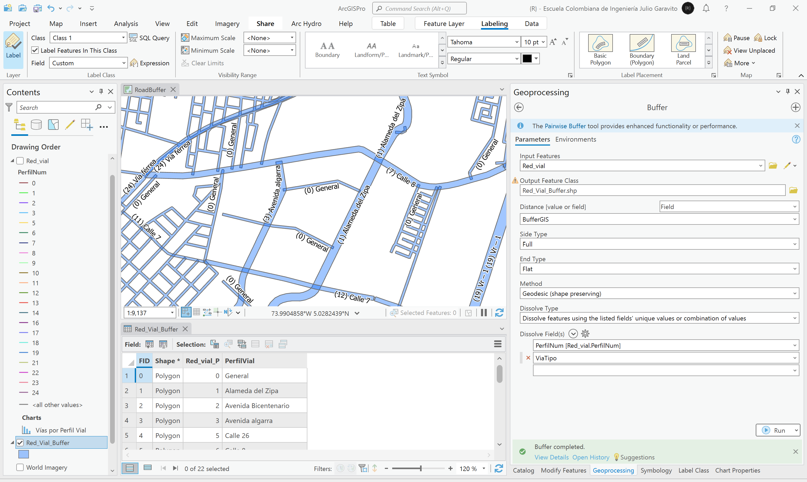

# Corredores viales urbanos y construcciones afectadas
Keywords: `road-buffer` `rail-buffer`

A partir de la capa de vías urbanas, sus jerarquías, y siguiendo las especificaciones de perfiles viales establecidas en el POT, cree las áreas aferentes o corredores viales. A partir de los buffers de vía generados y las construcciones disponibles en la cartografía del POT, realice una intersección e identifique las construcciones afectadas. Cree un reporte indicando el área total de la construcción, el área afectada, % de afectación y el corredor víal de la afectación.

## Objetivos

* Asociar a los ejes viales, los anchos de los corredores definidos en el POT.
* Generar áreas aferentes al rededor de los ejes viales, identificando construcciones afectadas en la implantación de proyectos de renovación vial.

## Requerimientos

* [:mortar_board:Actividad](../POTLayer/Readme.md): Inventario de información geo-espacial recopilada del POT y diccionario de datos.
* [:mortar_board:Actividad](../RoadSummary/Readme.md): Análisis estadístico de la red vial.
* [:notebook:Lectura](https://edu.gcfglobal.org/es/estadistica-basica/): Conocimientos básicos en estadística.
* [:toolbox:Herramienta](https://www.esri.com/en-us/arcgis/products/arcgis-pro/overview): ESRI ArcGIS Pro 3.3.1 o superior.
* [:toolbox:Herramienta](https://qgis.org/): QGIS 3.38 o superior.
* [:open_file_folder:RoadBuffer.xlsx](RoadBuffer.xlsx): libro con especificaciones de perfiles viales.

## 1. Creación de tabla de perfiles viales

> En las vías rurales, aplican los perfiles que se presentan en el siguiente cuadro, de conformidad con lo regulado por la Ley 1228 de 2008 en materia de franjas de retiro.
> 
> En cuanto a las vías urbanas que no son de carácter departamental o nacional, sus especificaciones son definidas directamente en el POT.

Siguiendo las especificaciones de perfiles viales establecidas en los Artículos 48 y 110 del POT, cree una tabla detallada en Excel ([RoadBuffer.xlsx](RoadBuffer.xlsx)) que contenga sus valores y las siguientes columnas:

| Columna    | Descripción                                                                                                                                            | Urbano y Expansión | Rural |
|------------|--------------------------------------------------------------------------------------------------------------------------------------------------------|:------------------:|:-----:|
| PerfilNum  | Código consecutivo de perfil. De 0 a n. El PerfiNum = 0, es utilizado para aplicar un perfil genérico a las vías urbanas sin perfil directo asociado.  |         ✓          |   ✓   |
| Zona       | Zona de aplicación: Urbano y expansión urbana, Rural.                                                                                                  |         ✓          |   ✓   |
| ViaTipo    | Descripción de la vía o nomenclatura al cual aplica el perfil vial.                                                                                    |         ✓          |   ✓   |
| Jerarquia  | Jerarquía vial. En vías urbanas corresponde a local, arterial o zonal. En vías rurales, corresponde al orden vial.                                     |         ✓          |   ✓   |
| Definicion | Definición detallada del corredor.                                                                                                                     |         ✓          |   ✓   |
| Descripc   | Descripción detallada del tramo al cual aplica.                                                                                                        |         ✓          |   ✓   |
| ZVerdeIzq  | Ancho de zona verde al lado izquierdo del perfil en metros.                                                                                            |                    |   ✓   |
| BermaCIzq  | Ancho de berma y cuneta al lado izquierdo del perfil en metros.                                                                                        |                    |   ✓   |
| AndenIzq   | Ancho del andén al lado izquierdo del perfil en metros.                                                                                                |         ✓          |       |
| CalzadaIzq | Ancho de calzada o sub-calzada al lado izquierdo del perfil en metros.                                                                                 |         ✓          |   ✓   |
| Separador  | Ancho de separador central del perfil en metros.                                                                                                       |         ✓          |   ✓   |
| CalzadaDer | Ancho de calzada o sub-calzada al lado derecho del perfil en metros.                                                                                   |         ✓          |   ✓   |
| Cicloruta  | Ancho de cicloruta al lado derecho del perfil en metros.                                                                                               |         ✓          |       |
| AndenDer   | Ancho del andén al lado derecho del perfil en metros.                                                                                                  |         ✓          |       |
| BermaCDer  | Ancho de berma y cuneta al lado derecho del perfil en metros.                                                                                          |                    |   ✓   |
| ZVerdeDer  | Ancho de zona verde al lado derecho del perfil en metros.                                                                                              |                    |   ✓   |
| PerfilTot  | Ancho total del perfil en metros.                                                                                                                      |         ✓          |   ✓   |
| BufferGIS  | Ancho del buffer geográfico en metros. `BufferGIS =  PerfilTot / 2`                                                                                    |         ✓          |   ✓   |

## 2. Homologación de vías rurales

1. Abra el proyecto de ArcGIS Pro, creado previamente y desde el menú _Insert_ cree un nuevo mapa _New Map_, renombre como _RoadBuffer_ y establezca el CRS 9377. Agregue al mapa la capa vías municipales creada en la actividad [Análisis estadístico de la red vial](../RoadSummary/Readme.md), desde la ruta `\file\shp\Red_vial.shp`, ajuste la simbología a valores únicos representando el campo de atributos `TIPO_FOR` y rotule a partir del nombre de la vía.  

2. En la tabla de atributos de la capa de la red vial, cree un campo numérico entero corto (short) con el nombre `PerfilNum`. Luego, utilizando la herramienta de selección por atributos, seleccione todas las vías rurales cuyo orden sea 1 y con el calculador de campo establezca el código de perfil número 19.

Repita el procedimiento anterior para las demás vías rurales y los órdenes viales 2 a 4. Modifique el rótulo incluyendo entre paréntesis, el código de perfil asignado.

Rótulo Arcade: `"(" + $feature.PerfilNum + ") " +$feature.NombreVia`

Para la vía rural proyectada de orden 1 (`ZonaNombre = 'Rural' And ORDEN_VIAL = 'Primer Orden-Via Proyectada'`), aplique el código 19.

3. Para la vía férrea, establezca el código 24, correspondiente a este corredor. 

> De conformidad con lo dispuesto en el artículo 3 de la Ley 76 de 1929, en una franja de 20 metros cuyo centro es el eje de la vía, no es posible realizar excavaciones, construcciones u otras obras que comprometan la estabilidad de la vía.
> 
> En la tabla de Excel, las vías férreas se han incluído como parte de los corredores rurales y su ancho se ha sido definido en la columna `Separador`. 

4. Para las vías rurales proyectadas, establezca el código 23, correspondiente a vías de cuarto orden.

## 3. Homologación de vías urbanas

1. Para las vías urbanas, realice selecciones por atributos para cada perfil definido en el POT y aplique el código correspondiente. Por ejemplo, para la _Alameda del Zipa_, el código a aplicar es `PerfilNum = 1`. Repita este procedimiento para las demás vías.

> La Avenida Algarra contiene dos perfiles diferentes y desde calle 8 hasta su terminación, no ha sido incluída en la capa de vías del POT.

2. En cuanto a la Calle 8, esta ha sido definida a partir de dos perfiles diferentes, entre la carrera 5 y via férrea, y entre vía férrea carrera 36. Los vectores encontrados no están segmentados hasta el límite de la vía férrea, por lo que deberá utilizar lad herramientas de edición _Explode_ para separar entidades multiparte, _Merge_ para unir los tramos de cada lado de la vía férres y _Split_ para segmentar la vía en la vía férrea.

Calle 8 inicial  

Calle 8, editada y ajustada  

> Para vías con varios perfiles definidos, edite y ajuste los tramos requeridos para asignar los códigos correspondientes.

3. Una vez finalizada la asociación de código de perfil y editados e integrados los tramos, guarde los cambios realizados en la capa, y recalcule las longitudes contenidas en el campo `LGkm`.

4. Cree una gráfica de barras con la longitud total de vías asociadas por cada código homologado en `PerfilNum`. Simbolice la red vial a partir de los códigos asignados. Podrá observar que los códigos 4, 15 y 20, no tienen vectores asociados debido a que no se encontraban digitalizados o caracterizados en la red víal. También podrá observar que el código 23, correspondiente a vías de cuarto orden, contiene la mayor longitud de tramos, seguido del código 0, correspondiente a vías urbanas sin perfil específico definido.  

## 4. Creación de buffers

1. Agregue al mapa la tabla de Excel _RoadBuffer.xlsx_, que contiene la descripción detallada de cada perfil. Abra la tabla y verifique que estén todos los registros de perfiles creados.

2. Utilizando el campo `PerfilNum`, cree una unión o _Join_ entre la capa de vías y la tabla de Excel.

3. Abra la tabla de atributos de la capa de vías y asegúrese que para todos los registros, se encuentran asociados los valores de los perfiles establecidos, verifique el campo `BufferGIS`.

4. Desde el panel _Geoprocessing_, ejecute la herramienta _Analysis Tools / Buffer_, utilice los parámetros mostrados en la siguiente imagen. Nombre la capa como `\file\shp\Red_Vial_Buffer.shp`. 

## 2. Análisis usando software libre - QGIS

Para el desarrollo de las actividades desarrolladas en esta clase, se pueden utilizar en QGIS las siguientes herramientas o geo-procesos:

| Proceso                                                                                                         | Procedimiento                                                                                                                                                                                                                                   |
|:----------------------------------------------------------------------------------------------------------------|:------------------------------------------------------------------------------------------------------------------------------------------------------------------------------------------------------------------------------------------------|
| Simbología                                                                                                      | Modificable desde las propiedades de la capa en la pestaña _Symbology_.                                                                                                                                                                         |
| Rotulado                                                                                                        | Modificable desde las propiedades de la capa en la pestaña _Labels_.                                                                                                                                                                            |

Ejemplo rótulo en QGIS: `'A(ha): ' ||  round("AGha", 2) || '\n' || 'P (m): ' ||  round("PGm", 2) `

[:notebook:QGIS training manual](https://docs.qgis.org/3.34/en/docs/training_manual/)

## Elementos requeridos en diccionario de datos

Agregue a la tabla resúmen generada en la actividad [Inventario de información geo-espacial recopilada del POT y diccionario de datos](../POTLayer/Readme.md), las capas generadas en esta actividad que se encuentran listadas a continuación:

| Nombre                           | Descripción                                                                                                                  | Geometría   | Registros | 
|----------------------------------|------------------------------------------------------------------------------------------------------------------------------|-------------|-----------| 
|                                  |                                                                                                                              | Polígono 2D | 14        | 
|                                  |                                                                                                                              | Polígono 2D | 14        | 
|                                  |                                                                                                                              | Polígono 2D | 14        | 

> :bulb:Para funcionarios que se encuentran ensamblando el SIG de su municipio, se recomienda incluir y documentar estas capas en el Diccionario de Datos.

## Actividades de proyecto :triangular_ruler:

En la siguiente tabla se listan las actividades que deben ser desarrolladas y documentadas por cada grupo de proyecto en un único archivo de Adobe Acrobat .pdf. El documento debe incluir portada (indicando el caso de estudio, número de avance, nombre del módulo, fecha de presentación, nombres completos de los integrantes), numeración de páginas, tabla de contenido, lista de tablas, lista de ilustraciones, introducción, objetivo general, capítulos por cada ítem solicitado, conclusiones y referencias bibliográficas.

| Actividad     | Alcance                                                                                                                                                                                                                                                                                                                                                                                                                                             |
|:--------------|:----------------------------------------------------------------------------------------------------------------------------------------------------------------------------------------------------------------------------------------------------------------------------------------------------------------------------------------------------------------------------------------------------------------------------------------------------|
| Avance **P3** | Esta actividad no requiere del desarrollo de elementos en el avance del proyecto final, los contenidos son evaluados en el quiz de conocimiento y habilidad.                                                                                                                                                                                                                                                                                        | 
| Avance **P3** | :compass:Mapa digital impreso _P3-1: xxxx_ Incluir xxxxx. Embebido dentro del informe final como una imágen y referenciados como anexo.                                                                                                                                                                                                                                                                                                          | 
| Avance **P3** | En una tabla y al final del informe de avance de esta entrega, indique el detalle de las sub-actividades realizadas por cada integrante de su grupo. Para actividades que no requieren del desarrollo de elementos de avance, indicar si realizo la lectura de la guía de clase y las lecturas indicadas al inicio en los requerimientos. Utilice las siguientes columnas: Nombre del integrante, Actividades realizadas, Tiempo dedicado en horas. | 

> No es necesario presentar un documento de avance independiente, todos los avances de proyecto de este módulo se integran en un único documento.
> 
> En el informe único, incluya un numeral para esta actividad y sub-numerales para el desarrollo de las diferentes sub-actividades, siguiendo en el mismo orden de desarrollo presentado en esta actividad.

## Compatibilidad

* Esta actividad puede ser desarrollada con cualquier software SIG que disponga de herramientas para de digitalización con opciones de encajado o snapping.
* 

## Referencias

* https://www.ani.gov.co/cual-es-la-franja-de-seguridad-de-los-corredores-ferreos-administrados-por-la-ani

## Control de versiones

| Versión    | Descripción                                                | Autor                                      | Horas |
|------------|:-----------------------------------------------------------|--------------------------------------------|:-----:|
| 2024.03.16 | Versión inicial con alcance de la actividad                | [rcfdtools](https://github.com/rcfdtools)  |   4   |
| 2024.07.19 | Investigación y documentación para caso de estudio general | [rcfdtools](https://github.com/rcfdtools)  |   8   |

_R.SIGE es de uso libre para fines académicos, conoce nuestra licencia, cláusulas, condiciones de uso y como referenciar los contenidos publicados en este repositorio, dando [clic aquí](LICENSE.md)._

_¡Encontraste útil este repositorio!, apoya su difusión marcando este repositorio con una ⭐ o síguenos dando clic en el botón Follow de [rcfdtools](https://github.com/rcfdtools) en GitHub._

| [:arrow_backward: Anterior](../GeoTable/Readme.md) | [:house: Inicio](../../README.md) | [:beginner: Ayuda / Colabora](https://github.com/rcfdtools/R.SIGE/discussions/99999) | [Siguiente :arrow_forward:]() |
|--------------------------------------------|-------------------|---------------------------------------------------------------------------|---------------|

[^1]: 