# Análisis de sub-zonas hidrográficas
Keywords: `colombia` `ideam` `hydrologic-area` `feature-envelope-to-polygon` `bounding-box`

A partir de la capa de zonificación hidrográfica de Colombia del IDEAM, seleccione y obtenga a partir del límite municipal, las subzonas hidrográficas con cubrimiento en la zona de estudio, exporte las sub-zonas identificadas, evalúe si las zub-zonas obtenidas permiten definir las subcuencas de los ríos principales identificados en el POT del municipio y genere un polígono envolvente.

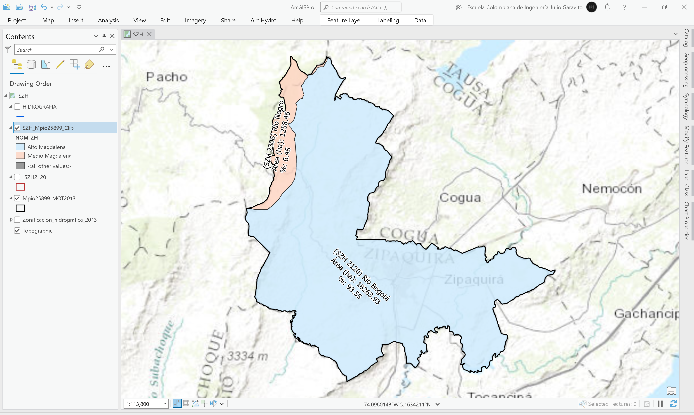

> En la ilustración, _COD_ZH_ corresponde al código de la Zona Hidrográfica.

## Objetivos

* Estudiar la estructura general de la zonificación hidrográfica de Colombia.
* Crear una capa geográfica que delimite la zona hidro-geográfica de estudio.
* Crear el polígono regular del dominio espacial que envuelve la zona de estudio.
* Calcular las sub-áreas y porcentajes de distribución de las subzonas obtenidas.

> El polígono regular permitirá en las siguientes actividades del curso, realizar la descarga de información satelital y seleccionar las estaciones hidroclimatológicas de la zona de estudio. 

## Requerimientos

* [:mortar_board:Actividad](../POTLayer/Readme.md): Inventario de información geo-espacial recopilada del POT y diccionario de datos.
* [:toolbox:Herramienta](https://www.esri.com/en-us/arcgis/products/arcgis-pro/overview): ESRI ArcGIS Pro 3.3.1 o superior.
* [:toolbox:Herramienta](https://qgis.org/): QGIS 3.38 o superior.

## 1. Zonificación hidrográfica de Colombia

La zonificación hidrográfica de Colombia desde el punto de vista hidrológico, tiene sus inicios en el HIMAT mediante la Resolución 0337 del 1978, la cual establece que el país está conformado por cinco Áreas hidrográficas (1-Caribe, 2- Magdalena - Cauca, 3- Orinoco, 4- Amazonas y 5-Pacífico) que a su vez están divididas en Zonas Hidrográficas y subdivididas en Subzonas Hidrográficas. En ese entonces, el propósito de la zonificación fue de adoptar un sistema de codificación para estaciones Hidrometerológicas. Posteriormente, el IDEAM introduce esta zonificación para otros fines, tales como estudios y análisis hidrológicos relacionados con los informes ambientales, p. ej. el Índice de Aridez, el Escurrimiento y el Rendimiento Hídrico.[^1]

La zonificación de cuencas hidrográficas corresponde a tres niveles de jerarquía: áreas, zonas y subzonas hidrográficas. Las áreas hidrográficas corresponden a las regiones hidrográficas o vertientes que, en sentido estricto, son las grandes cuencas que agrupan un conjunto de ríos con sus afluentes que desembocan en un mismo mar. Ahora bien, en Colombia se distinguen cuatro vertientes, dos de ellas asociadas a ríos de importancia continental (vertiente del Orinoco y vertiente del Amazonas) y las vertientes del Atlántico y del Pacífico. Se delimita adicionalmente como áea hidrográfica la cuenca Magdalena-Cauca, que aunque tributa y forma parte de la vertiente del Atlántico, tiene importancia socioeconómica por su alto poblamiento y aporte al producto interno bruto.[^2]

| AH  | Área Hidrográfica |
|-----|-------------------|
| 1   | Caribe            |
| 2   | Magdalena-Cauca   |
| 3   | Orinoco           |
| 4   | Amazonas          |
| 5   | Pacífico          |

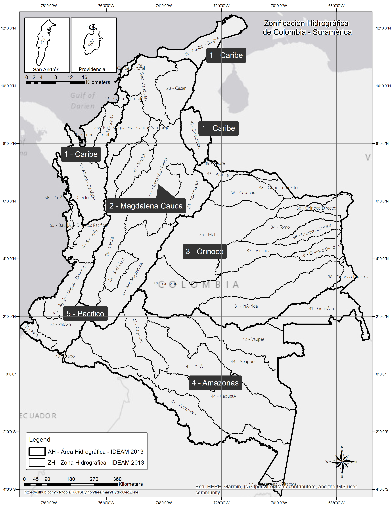

Las cuencas hidrográficas que entregan o desembocan sus aguas superficiales directamente de una área hidrográfica se denominaran zonas hidrográficas. Agrupan varias cuencas que se presentan como un subsistema hídrico con características de relieve y drenaje homogéneo y sus aguas tributan a través de un afluente principal hacia un área hidrográfica. Están integradas por cuencas de las partes altas, medias o bajas de una zona hidrográfica que captan agua y sedimentos de los tributarios de diferente orden tales como nacimientos de agua, arroyos, quebradas y ríos. Las cuencas que tributan sus aguas a su vez a las zonas hidrográficas se denomina subzonas hidrográficas. Ahora bien, respecto a la toponimia con que se identifican zonas y subzonas hidrográficas, a estas unidades se les asignó la toponimia de acuerdo con el nombre de la corriente más representativa o río principal o con el nombre heredado de la zonificación del HIMAT, que puede corresponder al espacio geográfico o región a la cual drenan las aguas superficiales.[^2]

| AH  | Área Hidrográfica | ZH  | Zona Hidrográfica                  |
|-----|-------------------|-----|------------------------------------|
| 1   | Caribe            | 11  | Atrato - Darién                    |
| 1   | Caribe            | 12  | Caribe - Litoral                   |
| 1   | Caribe            | 13  | Sinú                               |
| 1   | Caribe            | 15  | Caribe - La Guajira                |
| 1   | Caribe            | 16  | Catatumbo                          |
| 1   | Caribe            | 17  | Islas del Caribe                   |
| 2   | Magdalena - Cauca | 21  | Alto Magdalena                     |
| 2   | Magdalena - Cauca | 22  | Saldaña                            |
| 2   | Magdalena - Cauca | 23  | Medio Magdalena                    |
| 2   | Magdalena - Cauca | 24  | Sogamoso                           |
| 2   | Magdalena - Cauca | 25  | Bajo Magdalena - Cauca - San Jorge |
| 2   | Magdalena - Cauca | 26  | Cauca                              |
| 2   | Magdalena - Cauca | 27  | Nechí                              |
| 2   | Magdalena - Cauca | 28  | Cesar                              |
| 2   | Magdalena - Cauca | 29  | Bajo Magdalena                     |
| 3   | Orinoco           | 31  | Inírida                            |
| 3   | Orinoco           | 32  | Guaviare                           |
| 3   | Orinoco           | 33  | Vichada                            |
| 3   | Orinoco           | 34  | Tomo                               |
| 3   | Orinoco           | 35  | Meta                               |
| 3   | Orinoco           | 36  | Casanare                           |
| 3   | Orinoco           | 37  | Arauca                             |
| 3   | Orinoco           | 38  | Orinoco Directos                   |
| 3   | Orinoco           | 39  | Apure                              |
| 4   | Amazonas          | 41  | Guainía                            |
| 4   | Amazonas          | 42  | Vaupés                             |
| 4   | Amazonas          | 43  | Apaporis                           |
| 4   | Amazonas          | 44  | Caquetá                            |
| 4   | Amazonas          | 45  | Yarí                               |
| 4   | Amazonas          | 46  | Caguán                             |
| 4   | Amazonas          | 47  | Putumayo                           |
| 4   | Amazonas          | 48  | Amazonas - Directos                |
| 4   | Amazonas          | 49  | Napo                               |
| 5   | Pacífico          | 51  | Mira                               |
| 5   | Pacífico          | 52  | Patía                              |
| 5   | Pacífico          | 53  | Tapaje - Dagua - Directos          |
| 5   | Pacífico          | 54  | San Juan                           |
| 5   | Pacífico          | 55  | Baudó - Directos Pacífico          |
| 5   | Pacífico          | 56  | Pacífico - Directos                |
| 5   | Pacífico          | 57  | Islas del Pacífico                 |

> En el presente análisis no se han incluido resultados para la ZH - zona hidrográfica 57, correspondiente a las Islas del Pacífico, debido a que la capa geográfica SZH - subzonas hidrográficas no contiene el polígono de delimitación. 

## 2. Obtención e identificación de subzonas hidrográficas

El proceso de delimitación se realiza a partir de la cobertura de Subzonas hidrográficas de Colombia, este mapa representa las unidades de análisis para el ordenamiento ambiental de territorio definidas por el IDEAM en convenio con el Instituto Geográfico Agustín Codazzi (IGAC), a escala 1:500.000. [^3]

1. Ingrese al portal https://www.colombiaenmapas.gov.co/, en el cuadro de búsqueda escriba _Zonificación Hidrográfica_ y realice la descarga del archivo de formas Shapefile correspondiente al año 2013. Guarde y descomprima el archivo obtenido en la carpeta `\file\data\IDEAM\`.

> La descarga permite obtener un archivo comprimido que contiene la capa geográfica en formato Shapefile, un mapa de muestra en formato .pdf, un mapa en formato .pdf y otros elementos complementarios.

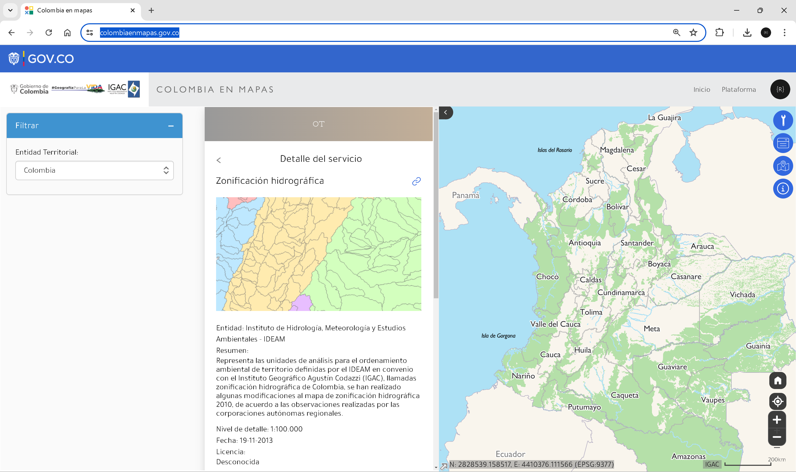

 Catálogo de objetos en Subzonas [^4]  

| Nombre       | Alias          | Definición                                                                    | Tipo de dato |
|--------------|----------------|-------------------------------------------------------------------------------|--------------|
| OBJECTID     | OBJECTID       | Identificador de objeto geográfico.                                           | Texto        |
| Shape        | Shape          | Tipo de geometría.                                                            | Geometría    |
| COD_AH       | Código Area    | Código del Area hidrográfica a la que corresponde.                            | Entero       |
| COD_ZH       | Código Zona    | Código de la Zona hidrográfica a la que corresponde.                          | Entero       |
| COD_SZH      | Código Subzona | Código de Subzona hidrográfica a la que corresponde.                          | Entero       |
| NOM_AH       | Nombre Área    | Nombre del área hidrográfica a la que corresponde. Dominio Área Hidrográfica. | Texto        |
| NOM_ZH       | Nombre Zona    | Nombre de la zona hidrográfica a la que corresponde.                          | Texto        |
| NOM_SZH      | Nombre Subzona | Nombre de la Subzona hidrográfica a la que corresponde.                       | Texto        |
| Shape_Length | Shape_Length   | Perímetro en las unidades del sistema de referencia espacial.                 | Entero       |
| Shape_Area   | Shape_Area     | Área en las unidades del sistema de referencia espacial.                      | Entero       |
| RULEID       | RULEID         | Id único asignado por el sistema a la representación gráfica.                 | Entero       |

2. Abra el proyecto de ArcGIS Pro, creado previamente y desde el menú _Insert_ cree un nuevo mapa _New Map_, renombre como _SZH_ y establezca el CRS 9377. Agregue al mapa la capa de zubzonas hidrográficas desde la ruta `\file\data\IDEAM\Zonificacion_hidrografica_2013.shp` y ajuste la simbología a valores únicos representando el campo de atributos `NOM_ZH` y rotule las zonas a partir del campo de atributos `COD_SZH` correspondiente a los códigos de las subzonas. 

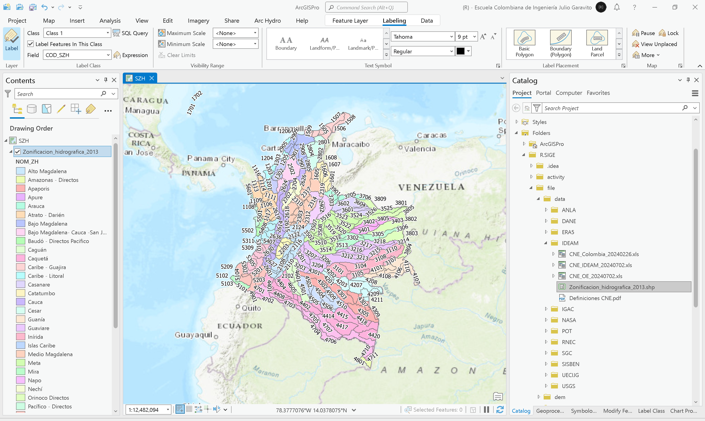

3. Agregue al mapa la capa `\file\shp\Mpio25899_MOT2013.shp` correspondiente al límite territorial municipal, generado a partir de la capa del Modelo de Ocupación Territorial - MOT en la actividad [Análisis veredal y límite territorial](../CountyLimit/Readme.md), simbolice solo por contorno y acerque a escala 1:25000 o similar. Realice una selección por localización de subzonas, podrá observar que el Municipio en estudio se encuentra sobre las subzona hidrográfica 2120, correspondiente al Río Bogotá en la zona del Alto Magdalena, y la subzona 2306, correspondiente al Río Negro en la zoma del Medio Magdalena.

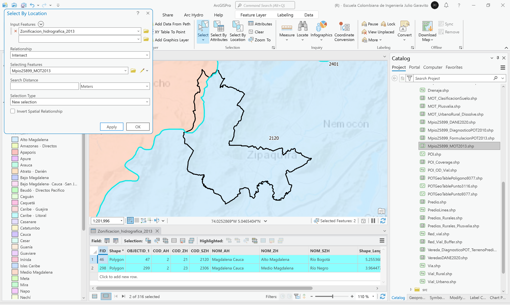

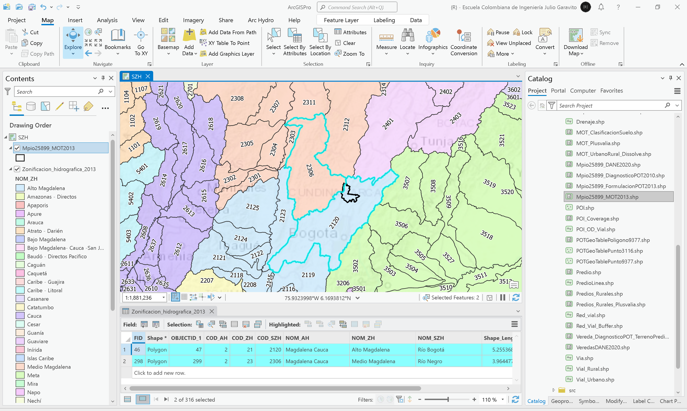

4. Agregue al mapa la capa `\file\data\POT\Anexo_Acuerdo_012_2013\shp\HIDROGRAFIA.shp`, correspondiente a los drenajes obtenidos de la formulación del POT, simbolice en color azul. Podrá observar que mayoritariamente los drenajes drenan hacia el Río Bogotá y que algunos de los drenajes localizados en la zona nor-occidental, drenan hacia la cuenca del Río Negro.

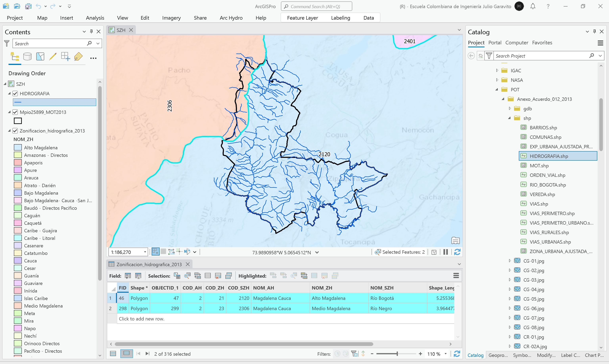

> :lady_beetle:Como puede observar en la ilustración anterior, las zubzonas hidrográficas no contienen las divisorias internas de los ríos principales identificados en el Plan de Ordenamiento Territorial, por lo cual es actividades posteriores del curso, generaremos a partir de modelos digitales de elevación, los límites de las cuencas hidrológicas. 

5. Debido a que generaremos una envolvente para el estudio climatológico local a partir de las subzonas hidrográficas y que la fracción del municipio correpondiente a la subzona 2306 del Río Negro se encuentra en zona de protección (tal como se evidenció en la revisión del MOT en la actividad [Análisis geográfico del Modelo de Ocupación Territorial - MOT](../LandUseAnalysis/Readme.md)), exportaremos únicamente la subzona correspondiente al Río Bogotá. Manualmente, seleccione la subzona hodrogáfica 2120 y dando clic derecho sobre la capa, exporte la selección como `\file\shp\SZH2120.shp`. Agregue al mapa y simbolice solo por contorno utilizando color rojo.

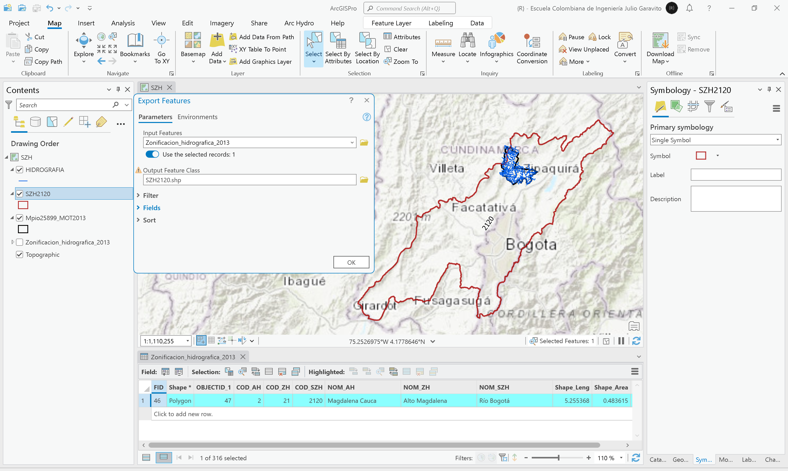

> :bulb:En el evento de que en su zona de estudio existan múltiples translapos con diferentes subzonas hidrográficas y que estas cubran gran parte de su área, será necesario realizar la extracción de estos polígonos y luego su disolución.

6. Calcule las áreas y los porcentajes de área municipal correspondientes a cada subzona hidrográfica. Para ello, limpie la selección de entidades realizada previamente y desde el panel lateral de geo-procesamiento, ejecute la herramienta _Analysis Tools / Clip_, nombre la capa como `\file\shp\SZH_Mpio25899_Clip.shp`.

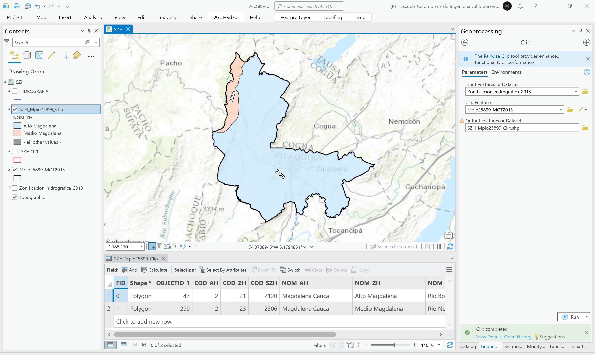

Agregue a la capa de recorte, dos campos numéricos dobles con los nombres AGha y AGhaDP; con el calculador de geometría y el calculador de campo, obtenga estos valores y rotule. Podrá observar, que el 93.55% del área municipal corresponde a la cuenca del Río Bogotá.

Rótulo Arcade: `"(SZH " + $feature.COD_SZH + ") " + $feature.NOM_SZH+"\nÁrea (ha): " + Round($feature.AGha, 2) + "\n%: " + Round($feature.AGhaDP, 2)`

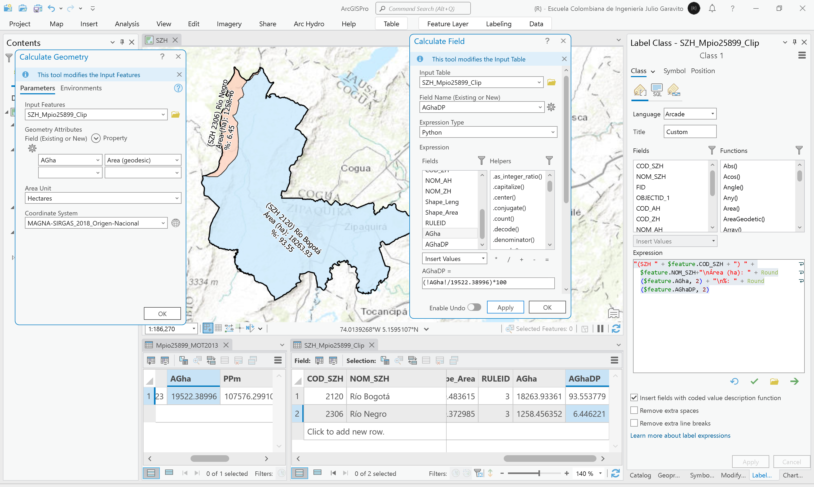

7. Utilizando la herramienta de geo-procesamiento _Data Management Tools / Features / Feature Envelope to Polygon_, cree el polígono regular envolvente de la subzona 2120 correspondiente al Río Bogotá, nombre la capa como `\file\shp\SZH2120_Envelope.shp`.

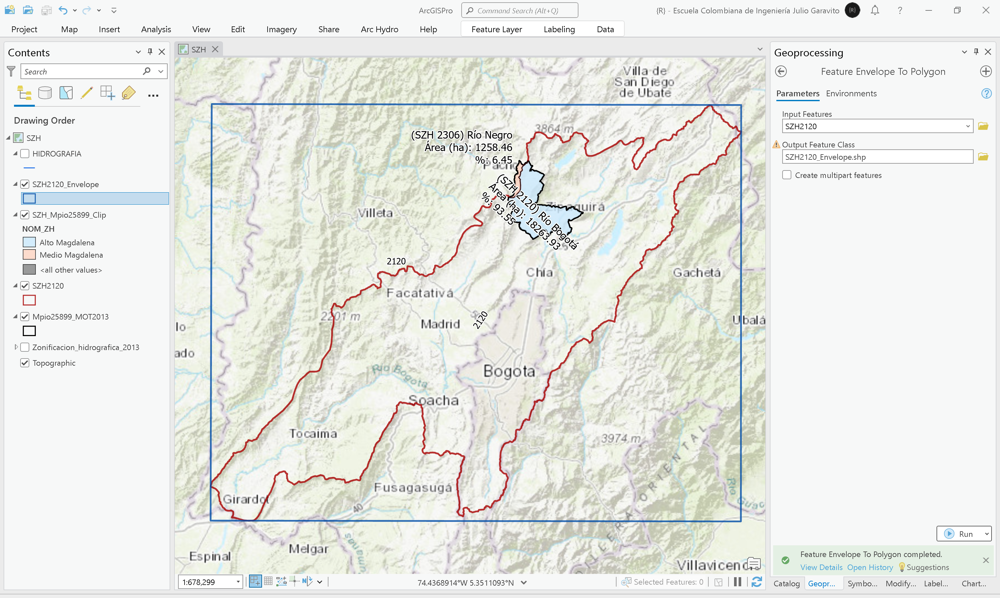

8. Utilizando la herramienta de geo-procesamiento _Analysis Tools / Buffer_, cree un buffer de 250 metros al rededor del polígono envolvente, nombre como `\file\shp\SZH2120_Envelope_Buffer250m.shp`.

> La creación del buffer, permitirá el recorte completo de las grillas de los modelos digitales de elevación y variables climatológicas, debido a que incluirá las celdas del contorno de en las esquinas perimetrales de generación de la envolvente.  

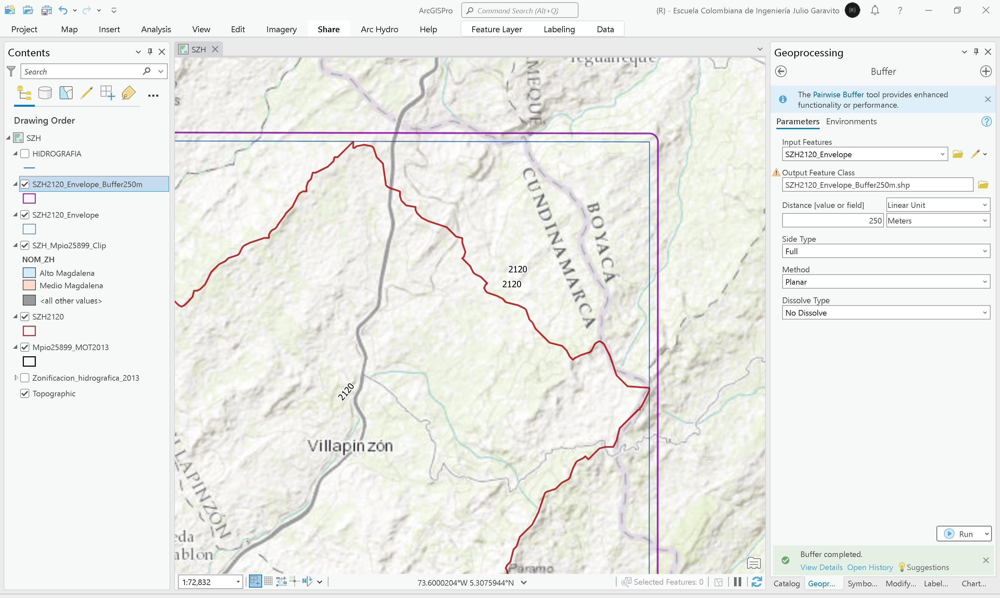

## 3. Análisis usando software libre - QGIS

Para el desarrollo de las actividades desarrolladas en esta clase, se pueden utilizar en QGIS las siguientes herramientas o geo-procesos:

| Proceso                                         | Procedimiento                                                                                                                                                                                                       |
|:------------------------------------------------|:--------------------------------------------------------------------------------------------------------------------------------------------------------------------------------------------------------------------|
| Simbología                                      | Modificable desde las propiedades de la capa en la pestaña _Symbology_.                                                                                                                                             |
| Rotulado                                        | Modificable desde las propiedades de la capa en la pestaña _Labels_.                                                                                                                                                |
| Cálculos geométricos o de campo                 | Directamente desde la tabla de atributos mediante el botón _Open Field Calculator_ o <kbd>Ctr</kbd>+<kbd>I</kbd>. La geometría de cálculo `$area` permite obtener el valor elipsoidal y `area` el valor proyectado. |
| Polígono envolvente (envelope o bounding boxes) | Herramienta disponible en el _Processing Toolbox / Vector Geometry / [Bounding boxes](https://docs.qgis.org/3.34/en/docs/user_manual/processing_algs/qgis/vectorgeometry.html#bounding-boxes)_.                     |
| Recorte de capas vectoriales (clip)             | Herramienta disponible en el _Processing Toolbox / Vector Overlay / [Clip](https://docs.qgis.org/3.34/en/docs/user_manual/processing_algs/qgis/vectoroverlay.html#clip)_.                                           |

Ejemplo rótulo en QGIS: `'A(ha): ' ||  round("AGha", 2) || '\n' || 'P (m): ' ||  round("PGm", 2) `

[:notebook:QGIS training manual](https://docs.qgis.org/3.34/en/docs/training_manual/)

## Elementos requeridos en diccionario de datos

Agregue a la tabla resúmen generada en la actividad [Inventario de información geo-espacial recopilada del POT y diccionario de datos](../POTLayer/Readme.md), las capas generadas en esta actividad que se encuentran listadas a continuación:

| Nombre                           | Descripción                                                                                                                                | Geometría   | Registros | 
|----------------------------------|--------------------------------------------------------------------------------------------------------------------------------------------|-------------|-----------| 
| SZH2120.shp                      | Polígono de la subzona hidrográfica 2120 correspondiente al Río Bogotá, obtenido a partir de la capa _Zonificacion_hidrografica_2013.shp_. | Polígono 2D | 1         | 
| SZH_Mpio25899_Clip.shp           | Intersección entre _Zonificacion_hidrografica_2013.shp_ y _Mpio25899_MOT2013.shp_.                                                         | Polígono 2D | 2         | 
| SZH2120_Envelope.shp             | Polígono envolvente al rededor de _SZH2120.shp_.                                                                                           | Polígono 2D | 1         | 
| SZH2120_Envelope_Buffer250m.shp  | Buffer o aferencia alrederor de la capa SZH2120_Envelope.shp.                                                                              | Polígono 2D | 1         | 

> :bulb:Para funcionarios que se encuentran ensamblando el SIG de su municipio, se recomienda incluir y documentar estas capas en el Diccionario de Datos.

## Actividades de proyecto :triangular_ruler:

En la siguiente tabla se listan las actividades que deben ser desarrolladas y documentadas por cada grupo de proyecto en un único archivo de Adobe Acrobat .pdf. El documento debe incluir portada (indicando el caso de estudio, número de avance, nombre del módulo, fecha de presentación, nombres completos de los integrantes), numeración de páginas, tabla de contenido, lista de tablas, lista de ilustraciones, introducción, objetivo general, capítulos por cada ítem solicitado, conclusiones y referencias bibliográficas.

| Actividad     | Alcance                                                                                                                                                                                                                                                                                                                                                                                                                                             |
|:--------------|:----------------------------------------------------------------------------------------------------------------------------------------------------------------------------------------------------------------------------------------------------------------------------------------------------------------------------------------------------------------------------------------------------------------------------------------------------|
| Avance **P3** | Identifique y exporte las zubzonas hidrográficas de su caso de estudio y evalúe si las zubzonas obtenidas, permiten definir las subcuencas de los ríos principales identificados en el POT del municipio.                                                                                                                                                                                                                                           | 
| Avance **P3** | Investigue y documente el procedimiento requerido para delimitar las cuencas hidrográficas correspondientes a los drenajes principales identificados en la zona de proyecto. No es necesario ejecutar el procedimiento investigado y obtener las cuencas principales dentro de la zona hidrográfica de su caso de estudio.                                                                                                                          | 
| Avance **P3** | :compass:Mapa digital impreso _P3-5: Subzonas hidrogáficas de Colombia y subzonas con cobertura en la zona de estudio._ Incluir áreas y porcentajes de distribución de subzonas. Embebido dentro del informe final como una imágen y referenciados como anexo.                                                                                                                                                                                   | 
| Avance **P3** | En una tabla y al final del informe de avance de esta entrega, indique el detalle de las sub-actividades realizadas por cada integrante de su grupo. Para actividades que no requieren del desarrollo de elementos de avance, indicar si realizo la lectura de la guía de clase y las lecturas indicadas al inicio en los requerimientos. Utilice las siguientes columnas: Nombre del integrante, Actividades realizadas, Tiempo dedicado en horas. | 

> No es necesario presentar un documento de avance independiente, todos los avances de proyecto de este módulo se integran en un único documento.
> 
> En el informe único, incluya un numeral para esta actividad y sub-numerales para el desarrollo de las diferentes sub-actividades, siguiendo en el mismo orden de desarrollo presentado en esta actividad.

### Referencias

* https://pro.arcgis.com/en/pro-app/latest/tool-reference/data-management/feature-envelope-to-polygon.htm
* https://pro.arcgis.com/en/pro-app/latest/tool-reference/data-management/h-how-dissolve-data-management-works.htm
* https://pro.arcgis.com/en/pro-app/latest/tool-reference/data-management/calculate-field.htm
* https://docs.qgis.org/2.18/en/docs/user_manual/processing_algs/qgis/vector_geometry_tools.html

## Control de versiones

| Versión    | Descripción                                                            | Autor                                      | Horas |
|------------|:-----------------------------------------------------------------------|--------------------------------------------|:-----:|
| 2024.03.17 | Versión inicial con alcance de la actividad                            | [rcfdtools](https://github.com/rcfdtools)  |   4   |
| 2024.07.23 | Investigación, documentación y desarrollo para caso de estudio general | [rcfdtools](https://github.com/rcfdtools)  |   6   |

_R.SIGE es de uso libre para fines académicos, conoce nuestra licencia, cláusulas, condiciones de uso y como referenciar los contenidos publicados en este repositorio, dando [clic aquí](LICENSE.md)._

_¡Encontraste útil este repositorio!, apoya su difusión marcando este repositorio con una ⭐ o síguenos dando clic en el botón Follow de [rcfdtools](https://github.com/rcfdtools) en GitHub._

| [:arrow_backward: Anterior](../POI/Readme.md) | [:house: Inicio](../../README.md) | [:beginner: Ayuda / Colabora](https://github.com/rcfdtools/R.SIGE/discussions/21) | [Siguiente :arrow_forward:]() |
|-----------------------------------------------|-----------------------------------|-----------------------------------------------------------------------------------|-------------------------------|

[^1]: http://www.ideam.gov.co/web/agua/zonificacion-hidrografica
[^2]: http://documentacion.ideam.gov.co/openbiblio/bvirtual/022655/MEMORIASMAPAZONIFICACIONHIDROGRAFICA.pdf
[^3]: http://geoservicios.ideam.gov.co/geonetwork/srv/eng/catalog.search#/metadata/7696695f-ae9c-4780-a6d0-d3cd1808819a
[^4]: http://geoservicios.ideam.gov.co/CatalogoObjetos/queryByUUID?uuid=bcd645c9-0f11-4770-926e-1e1fdfbf5ce6
