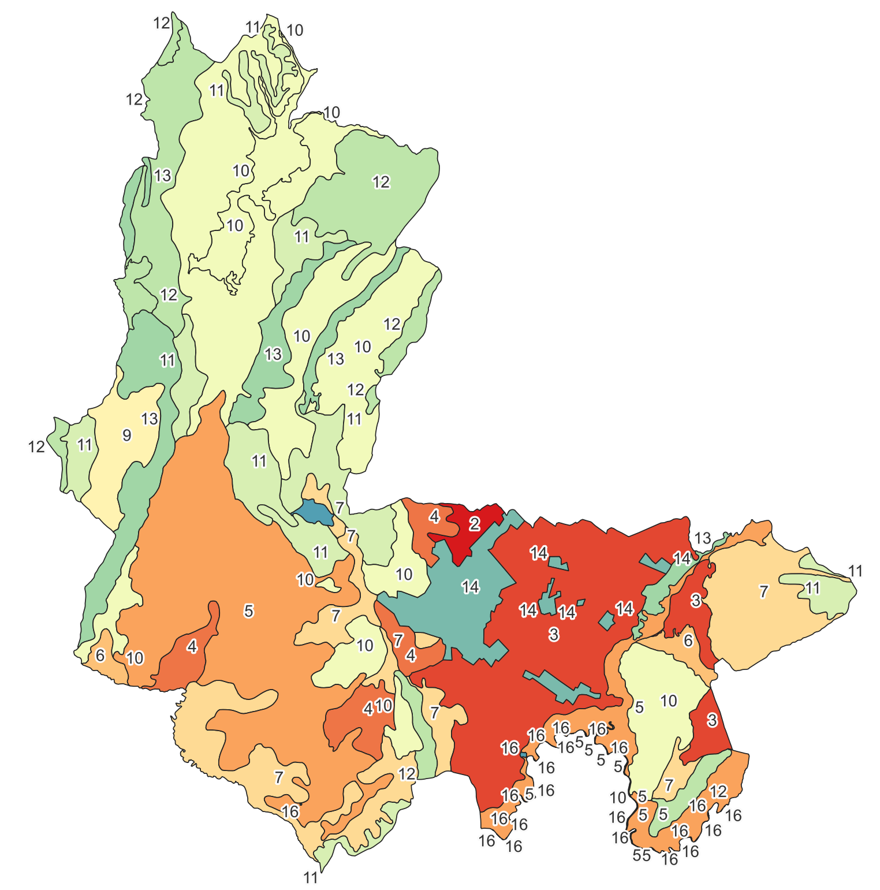
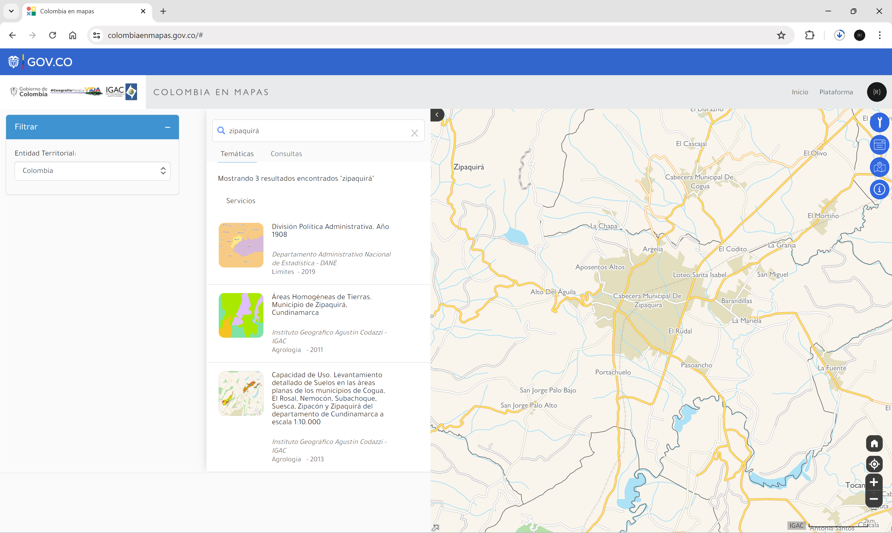
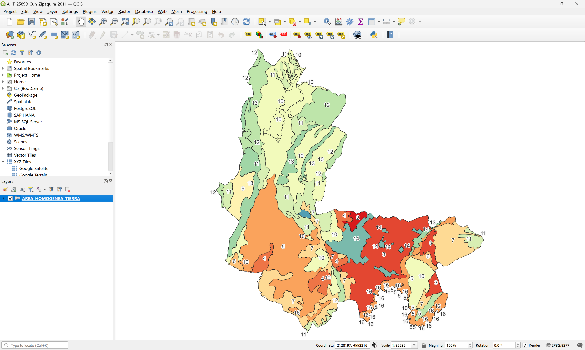
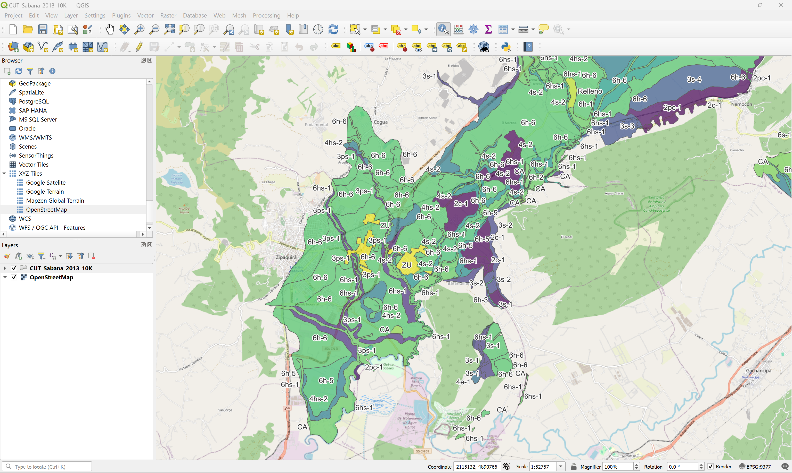
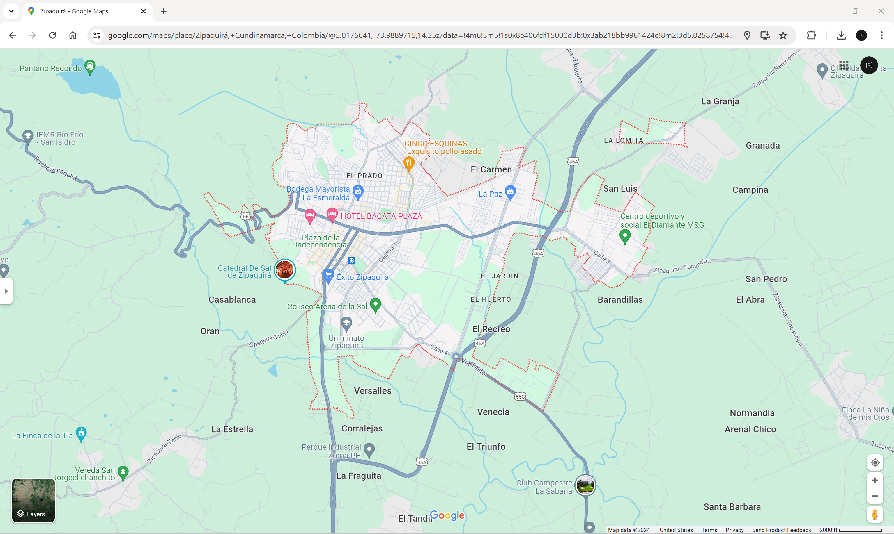

# Reseña histórica municipal del caso de estudio  
Keywords: `History` `StudyCase`

Zipaquirá es un municipio de Colombia ubicado en el departamento de Cundinamarca, en la provincia de Sabana Centro, de la que es capital. Es el segundo municipio más grande y poblado de la provincia. Es uno de los centros de explotación de sal más importantes del país, razón por la que también es conocida como la Capital Salinera de Colombia.

 Áreas homogéneas de tierra - Municipio de Zipaquirá Tomado de: <a href="https://www.colombiaenmapas.gov.co">https://www.colombiaenmapas.gov.co</a>  

> Reseña histórica es una expresión que se utiliza para explicar o repasar los hechos del pasado reciente o lejano, de un asunto determinado.

## Objetivos

* Entender el contexto histórico del municipio del caso de estudio
* Identificar información geo-espacial disponible en fuentes de datos públicas

## Requerimientos

* Grupo de trabajo con código asignado para el desarrollo del proyecto
* Caso de estudio propuesto, revisado y aprobado

## 1. Historía del municipio  
Referencia: tomado de https://es.wikipedia.org/wiki/Zipaquir%C3%A1

De fundación prehispánica, sus pobladores se asentaban en el sector hoy conocido como "Pueblo viejo" a 200 metros aproximados de su actual emplazamiento. Fue erigida como villa el 18 de julio de 1600 por auto de poblamiento proferido por el oidor español Luis Henríquez. Fue sucesivamente capital de la Provincia de Cundinamarca (1851), de la Provincia de Zipaquirá (1852-1855), del Estado Soberano de Cundinamarca (1861-1864), del departamento de Quesada (1905-1908) y del departamento de Zipaquirá (1908-1910). Zipaquirá es reconocida a nivel internacional por su Catedral de Sal, la cual recibió el reconocimiento como primera de las "Siete maravillas de Colombia” el 4 de febrero de 2007, además de su casco urbano, el cual fue declarado patrimonio histórico y cultural de Colombia.

## 2. Localización geográfica y topografía

La ciudad de Zipaquirá está situada en el Valle de El Abra, sobre la cordillera Oriental, en el altiplano Cundiboyacense. El casco urbano se encuentra a una altitud de 2652 m s. n. m., lo que la convierte en la tercera ciudad con mayor altitud en Colombia con más de 100.000 habitantes de acuerdo a la lista de las grandes ciudades más altas del mundo. Zipaquirá posee una extensión aproximada de 197 km² así: 8 km² de la zona urbana y 189 km² de la zona rural. El territorio donde se asienta la ciudad fue en el pasado un gran campo lleno de vegetación; algunos sectores de la ciudad también están construidos sobre unos viejos fosos de agua-sal, en los que la sal vigua era procesada para su consumo. Su río más extenso es el río Bogotá, pasando por el borde oriental de Zipaquirá en límites con Tocancipá y Sopó que desde hace varias décadas presenta altos niveles de contaminación, finalizando en Girardot. La zona en donde está ubicada la ciudad corresponde a la placa tectónica sudamericana, por lo que presenta una importante actividad sísmica.

La zona rural del municipio está compuesta por diecisiete (17) veredas

| Vereda                  | Código DANE   |
|:------------------------|:--------------|
| Barandillas             |               |
| Barroblanco             |               |
| El Tunal                |               |
| Empalizado              |               |
| La Granja               |               |
| Páramo del Guerrero Oc. |               |
| Pasoancho               |               |
| Portachuelo             |               |
| Río Frío                |               |
| Salinas (El Centro)     |               |
| San Antonio             |               |
| San Isidro              |               |
| San Jorge               |               |
| Ventalarga              |               |

En la zona rural se encuentran los siguientes centros poblados

| Centro poblado     | Vereda |
|:-------------------|:-------|
| Aposentos altos    |        |
| Argélia            |        |
| Barandillas        |        |
| Bolívar 83         |        |
| Bosques de Silesia |        |
| El Rudal           |        |
| La Mariela         |        |
| Malagón            |        |
| La Paz             |        |
| Pasoancho          |        |
| Portachuelo        |        |
| San Jorge          |        |
| San Miguel         |        |
| Santa Isabel       |        |

## 3. Principales actividades económicas

Las principales actividades económicas del municipio son:

* Agropecuaria: ganadería, cultivos de flores, cultivos de papa
* Industrial: extracción, procesamiento y refinamiento de sal
* Turística: Catedral de Sal

## 4. Mapas de referencia

Información geo-espacial específica del municipio que puede ser consultada en línea a través de los siguientes portales, plataformas o servicios:

| Plataforma                                               | Información consultable                                                                                                                                                                                                                                                                                                                                                                               |
|----------------------------------------------------------|-------------------------------------------------------------------------------------------------------------------------------------------------------------------------------------------------------------------------------------------------------------------------------------------------------------------------------------------------------------------------------------------------------|
| [Colombia en Mapas](https://www.colombiaenmapas.gov.co/) | Áreas Homogéneas de Tierras - Municipio de Zipaquirá, Cundinamarca. Capacidad de Uso - Levantamiento detallado de Suelos en las áreas planas de los municipios de Cogua, El Rosal, Nemocón, Subachoque, Suesca, Zipacón y Zipaquirá del departamento de Cundinamarca a escala 1:10.000. En la cartografía básica a escala 1:500k, 1:100k y 1:25k se encuentran múltiples vectores sobre el municipio. |
| Sistema de información geográfica municipal              | No disponible o no encontrado                                                                                                                                                                                                                                                                                                                                                                         |
| [Google Maps ](https://www.google.com/maps)              | Disponible: mapa satelital, mapa vectorial, mapa de terreno, mapa de tráfico, street view, puntos de interés, vías, límite urbano                                                                                                                                                                                                                                                                     |
| [Microsoft Bing Maps](https://www.bing.com/maps)         |                                                                                                                                                                                                                                                                                                                                                                                                       |
| [Open Street Maps ](https://www.openstreetmap.org)       |                                                                                                                                                                                                                                                                                                                                                                                                       |
| [Google Earth ](https://earth.google.com)                |                                                                                                                                                                                                                                                                                                                                                                                                       |

### 4.1. Colombia en Mapas

[Colombia en Mapas](https://www.colombiaenmapas.gov.co/inicio/) es la colección más completa de mapas de Colombia. Es una herramienta en constante evolución. Construido para que todos los colombianos puedan consumir los datos, productos y servicios geográficos. No estamos solos en esto. Colombia en Mapas es el vehículo que dispone y centraliza la información geográfica producida por el IGAC y por todas las entidades nacionales, regionales y locales que generan datos del territorio, con el fin de promover la toma de decisiones efectivas del gobierno, las industrias y el ciudadano.

 Zipaquirá en Colombia en Mapas del IGAC Tomado de: <a href="https://www.colombiaenmapas.gov.co">https://www.colombiaenmapas.gov.co</a>  

#### 4.1.1. Áreas Homogéneas de Tierras. Municipio de Zipaquirá, Cundinamarca

El mapa digital de Áreas Homogéneas de Tierras (AHT) con fines multipropósito a escala 1:25.000, representa características y cualidades similares de clima, relieve, material litológico o depósitos superficiales que dan origen a los suelos, lo cual permite delimitar espacios de la superficie terrestre en trece clases de AHT e identificarlas según sus principales limitaciones y caracterizarlas, a través de un índice numérico denominado valor potencial, que expresa la capacidad productiva de las tierras. Esta información geográfica se constituye en una de las más importantes aplicaciones de los levantamientos de suelos a diferentes escalas cartográficas, siendo el insumo base para calificar la capacidad productiva de las tierras rurales.

Este producto es generado por la Subdirección de Agrología del Instituto Geográfico Agustín Codazzi  - IGAC, para el municipio de Zipaquirá (Cundinamarca) a escala 1:25.000.

 Áreas Homogéneas de Tierras. Municipio de Zipaquirá, Cundinamarca Tomado de: <a href="https://www.colombiaenmapas.gov.co">https://www.colombiaenmapas.gov.co</a>  

#### 4.1.2. Capacidad de Uso. Levantamiento detallado de Suelos en las áreas planas de los municipios de Cogua, El Rosal, Nemocón, Subachoque, Suesca, Zipacón y Zipaquirá del departamento de Cundinamarca a escala 1:10.000

Mapa temático que representa la clasificación por Capacidad de Uso de las Tierras de las áreas planas de los municipios de Cogua, el Rosal, Nemocón, Subachoque, Suesca, Zipacón y Zipaquirá, Departamento de Cundinamarca a escala 1:10.000, publicado en el año 2013. Suministra información importante acerca del recurso suelo, a través de la determinación de las potencialidades y limitaciones de uso de las tierras a partir del análisis de las características de los suelos. Se definen las unidades cartográficas de capacidad de uso de la tierra con sus respectivos componentes: Clase, Subclase, Grupo de manejo, Principales Limitantes y Prácticas de Manejo.

Este producto es generado por la Subdirección de Agrología del Instituto Geográfico Agustín Codazzi - IGAC, para el Departamento de Cundinamarca.

 Capacidad de Uso. Levantamiento detallado de Suelos en las áreas planas de los municipios de Cogua, El Rosal, Nemocón, Subachoque, Suesca, Zipacón y Zipaquirá del departamento de Cundinamarca a escala 1:10.000 Tomado de: <a href="https://www.colombiaenmapas.gov.co">https://www.colombiaenmapas.gov.co</a>  

4.2. Mapas disponibles en Google Maps

## Actividades complementarias :pencil2:

En la siguiente tabla se listan las actividades complementarias que deben ser desarrolladas y documentadas por el estudiante en un único archivo de Adobe Acrobat .pdf. El documento debe incluir portada (mostrar nombre completo, código y enlace a su cuenta de GitHub), numeración de páginas, tabla de contenido, lista de tablas, lista de ilustraciones, introducción, objetivo general, capítulos por cada ítem solicitado, conclusiones y referencias bibliográficas.

| Actividad | Alcance |
|:---------:|:--------|
|     1     | ....    | 

## Referencias

* https://es.wikipedia.org/wiki/Zipaquir%C3%A1

## Control de versiones

| Versión    | Descripción     | Autor                                      | Horas |
|------------|:----------------|--------------------------------------------|:-----:|
| 2022.07.20 | Versión inicial | [rcfdtools](https://github.com/rcfdtools)  |   0   |

_R.SIGE es de uso libre para fines académicos, conoce nuestra licencia, cláusulas, condiciones de uso y como referenciar los contenidos publicados en este repositorio, dando [clic aquí](LICENSE.md)._

_¡Encontraste útil este repositorio!, apoya su difusión marcando este repositorio con una ⭐ o síguenos dando clic en el botón Follow de [rcfdtools](https://github.com/rcfdtools) en GitHub._

| [:arrow_backward: Anterior](../xxxx) | [:house: Inicio](../../README.md) | [:beginner: Ayuda / Colabora](https://github.com/rcfdtools/R.SIGE/discussions/99999) | [Siguiente :arrow_forward:]() |
|---------------------|-------------------|---------------------------------------------------------------------------|---------------|

[^1]: 