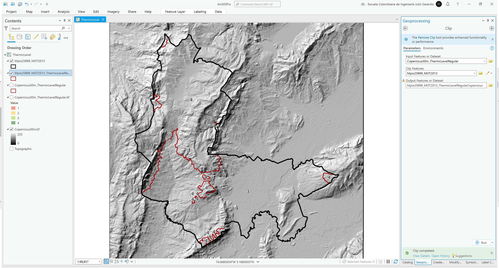

# Mapa de pisos térmicos
Keywords: `thermic-level` `reclassify`

A partir del modelo digital de elevación ESA Copernicus, crear los mapas de pisos térmicos con clasificación convencional (cortes cada 1000 m.s.n.m) y clasificación Francisco José de Caldas (año 1802, intervalos: 800, 1800, 2800, 3700 y 4700 m.s.n.m). A partir del límite obtenido del mapa MOT, determine las áreas por cada piso térmico.

## Objetivos

* Crear y clasificar mapas de pisos térmicos.
* Calcular áreas por piso térmico dentro del límite de la zona de estudio.

## Requerimientos

* [:mortar_board:Actividad](../TopoBasic/Readme.md): Conceptos básicos de topografía, fotogrametría y fotointerpretación.
* [:mortar_board:Actividad](../POTLayer/Readme.md): Inventario de información geo-espacial recopilada del POT y diccionario de datos.
* [:mortar_board:Actividad](../DEMSlope/Readme.md): Modelo digital de elevación - DEM a partir de sensores remotos satelitales.
* [:toolbox:Herramienta](https://www.esri.com/en-us/arcgis/products/arcgis-pro/overview): ESRI ArcGIS Pro 3.3.1 o superior.
* [:toolbox:Herramienta](https://qgis.org/): QGIS 3.38 o superior.

## 0. Arreglos de datos para clasificación de estaciones por pisos térmicos

Para el estudio de pisos térmico en Colombia, utilizaremos las siguientes clasificaciones.

**Cortes convencionales**

| Valor de corte | Etiqueta                        |
|----------------|---------------------------------|
| 1000           | Cálido, 24°C+, <= 1000 meters   |
| 2000           | Templado, 18°C+, <= 2000 meters |
| 3000           | Frío, 12°C+, <= 3000 meters     |
| 4000           | Páramo, 0°C, <= 4000 meters     |
| 99999          | Glacial, 0°C-, > 4000 meters    |

> A su vez existe la zonificación climática Caldas-Lang que subdivide los anteriores según la humedad (Superhúmedo, Húmedo, Semihúmedo, Semiárido, Árido y Desértico) en  veinticinco tipos climáticos.

**Cortes Francisco José de Caldas (simplificados), año 1802**

| Valor de corte | Etiqueta                                    |
|----------------|---------------------------------------------|
| 800            | Cálido, T>=24°C, <=800meter                 |
| 1800           | Templado, 24°C>T>18°C, <=1800meter          |
| 2800           | Frío, 18°C>T>12°C, <=2800meter              |
| 3700           | Muy Frío, 12°C>T>6°C, <=3700meter           |
| 4700           | Extremadamente Frio, 6°C>T>0°C, <=4700meter |
| 99999          | Nival, T<0°C, >4700meter                    |

> Existen clasificaciones complementarias como la Köppen-Geiger [^1] que para el caso de Colombia, presentan los climas tropicales hasta los polares de altitud pasando por climas secos y templados de montaña, con la ausencia absoluta de los climas continentales, ya que está dentro de la zona intertropical donde la radiación solar llega directamente y las latitudes no permiten la formación de tales climas.

## 1. Procedimiento general para clasificación convencional

1. Abra el proyecto de ArcGIS Pro, creado previamente y desde el menú _Insert_ cree un nuevo mapa _New Map_, renombre como _ThermicLevel_ y establezca el CRS 9377. Agregue al mapa la capa del límite territorial municipal generado a partir del Modelo de Ocupación Territorial - MOT disponible `\file\gdb\SIGE.gdb\SIGE\Mpio25899_MOT2013`, ajuste la simbología solo por contorno y agregue el modelo digital de elevación DEM Copernicus desde la ruta `\file\dem\Copernicus\Copernicus30m.tif` simbolizando por sombreado de relieve.  

2. Utilizando la herramienta de geo-procesamiento _3D Analyst Tools / Reclassify_, reclasifique el mapa de elevaciones Copernicus por cortes convencionales, nombre como `\file\dem\Copernicus\Copernicus30m_ThermicLevelRegular.tif` y simbolice a partir de la paleta _Condition Number_ correspondiente a colores de verde a amarillo y rojo. Podrá observar que dentro del límite del municipio en estudio solo existen los pisos térmicos correspondientes a las clases 3 y 4 de hasta 3000 o 4000 m.s.n.m.

3. Utilizando la herramienta de geo-procesamiento _Conversion Tools / Raster To Polygon_, convierta el mapa de reclasificación en una capa geográfica vectorial de polígonos, nombre como `\file\gdb\SIGE.gdb\SIGE\Copernicus30m_ThermicLevelRegular` y simbolice solo por contornos en color rojo. 

4. Utilizando la herramienta de geo-procesamiento `Analysis Tools / Clip`, recorte la capa de polígonos de delimitación de pisos térmicos hasta el límite municipal del MOT y guarde como `\file\gdb\SIGE.gdb\SIGE\Mpio25899_MOT2013_ThermicLevelRegularCopernicus`.

5. En la tabla de atributos de la capa vectorial recortada, agregue un campo de atributos tipo texto de 100 caracteres con el nombre `Label` e incluya los valores de las etiquetas por piso térmico, en campos numéricos dobles complementarios, calcule el área planar en hectáreas y su porcentaje con respecto al total. Simbolice y rotule a partir de este campo.

> Para mejorar la visualización del mapa obtenido y utilizando el editor de geometría, integre en una entidad multiparte los polígonos con el mismo valor de `gridcode`.

Rótulo Arcade: `$feature.Label + "\nArea (ha): " + Round($feature.APha, 2) + " (" + Round($feature.APPorc, 2) + "%)"`

Como puede observar, la zona de estudio se encuentra en pisos térmicos de clima frío con 43.93% del área municipal y páramo con el 56.07% restante.

## 2. Análisis usando software libre - QGIS

Para el desarrollo de las actividades desarrolladas en esta clase, se pueden utilizar en QGIS las siguientes herramientas o geo-procesos:

| Proceso                                              | Procedimiento                                                                                                                                                             |
|:-----------------------------------------------------|:--------------------------------------------------------------------------------------------------------------------------------------------------------------------------|
| Simbología                                           | Modificable desde las propiedades de la capa en la pestaña _Symbology_.                                                                                                   |
| Rotulado                                             | Modificable desde las propiedades de la capa en la pestaña _Labels_.                                                                                                      |
| Reclasificación de imágenes (Reclassify)             | Herramienta disponible en el _Processing Toolbox /Raster analysis / Reclassify by table.                                                                                  |
| Conversión de ráster a polígono (Raster to Polygon)  | Herramienta disponible en el _Processing Toolbox / GDAL / Raster conversion / Polygonize (raster to vector).                                                              |
| Recorte de capas vectoriales (clip)                  | Herramienta disponible en el _Processing Toolbox / Vector Overlay / [Clip](https://docs.qgis.org/3.34/en/docs/user_manual/processing_algs/qgis/vectoroverlay.html#clip)_. |

Ejemplo rótulo en QGIS: `'A(ha): ' ||  round("AGha", 2) || '\n' || 'P (m): ' ||  round("PGm", 2) `

[:notebook:QGIS training manual](https://docs.qgis.org/3.34/en/docs/training_manual/)  
[:notebook:Herramientas comúnmente utilizadas en QGIS](../QGIS.md)

## Elementos requeridos en diccionario de datos

Agregue a la tabla resúmen generada en la actividad [Inventario de información geo-espacial recopilada del POT y diccionario de datos](../POTLayer/Readme.md), las capas generadas en esta actividad que se encuentran listadas a continuación:

| Nombre                                           | Descripción                                                                                       | Geometría   | Registros | 
|--------------------------------------------------|---------------------------------------------------------------------------------------------------|-------------|-----------| 
| Copernicus30m_ThermicLevelRegular.tif            | Grilla de reclasificación de elevación a pisos térmicos a partir de DEM Copernicus.               | (grid)      | n/a       | 
| Copernicus30m_ThermicLevelRegular                | Polígonos de reclasificación de pisos térmicos a partir de Copernicus30m_ThermicLevelRegular.tif. | Polígono 2D | 55        | 
| Mpio25899_MOT2013_ThermicLevelRegularCopernicus  | Polígonos de reclasificación de pisos térmicos recortado hasta el límite del MOT.                 | Polígono 2D | 2         | 

> :bulb:Para funcionarios que se encuentran ensamblando el SIG de su municipio, se recomienda incluir y documentar estas capas en el Diccionario de Datos.

## Actividades de proyecto :triangular_ruler:

En la siguiente tabla se listan las actividades que deben ser desarrolladas y documentadas por cada grupo de proyecto en un único archivo de Adobe Acrobat .pdf. El documento debe incluir portada (indicando el caso de estudio, número de avance, nombre del módulo, fecha de presentación, nombres completos de los integrantes), numeración de páginas, tabla de contenido, lista de tablas, lista de ilustraciones, introducción, objetivo general, capítulos por cada ítem solicitado, conclusiones y referencias bibliográficas.

| Actividad     | Alcance                                                                                                                                                                                                                                                                                                                                                                                                                                             |
|:--------------|:----------------------------------------------------------------------------------------------------------------------------------------------------------------------------------------------------------------------------------------------------------------------------------------------------------------------------------------------------------------------------------------------------------------------------------------------------|
| Avance **P5** | Realice el análisis de pisos térmicos convencionales y pisos térmicos a partir de los valores simplificados de Caldas.                                                                                                                                                                                                                                                                                                                              | 
| Avance **P5** | :compass:Mapa digital impreso _P5-12: Mapa de pisos térmicos clasificación convencional._ Incluir rótulos internos en zona de estudio con valores de área y porcentaje. Embebido dentro del informe final como una imágen y referenciados como anexo.                                                                                                                                                                                            | 
| Avance **P5** | :compass:Mapa digital impreso _P5-13: Mapa de pisos térmicos clasificación simplificada Caldas._ Incluir rótulos internos en zona de estudio con valores de área y porcentaje. Embebido dentro del informe final como una imágen y referenciados como anexo.                                                                                                                                                                                     | 
| Avance **P5** | En una tabla y al final del informe de avance de esta entrega, indique el detalle de las sub-actividades realizadas por cada integrante de su grupo. Para actividades que no requieren del desarrollo de elementos de avance, indicar si realizo la lectura de la guía de clase y las lecturas indicadas al inicio en los requerimientos. Utilice las siguientes columnas: Nombre del integrante, Actividades realizadas, Tiempo dedicado en horas. | 

> No es necesario presentar un documento de avance independiente, todos los avances de proyecto de este módulo se integran en un único documento.
> 
> En el informe único, incluya un numeral para esta actividad y sub-numerales para el desarrollo de las diferentes sub-actividades, siguiendo en el mismo orden de desarrollo presentado en esta actividad.

## Referencias

* https://pro.arcgis.com/en/pro-app/latest/tool-reference/conversion/raster-to-polygon.htm
* https://www.portaluniciso.com/info/CLIM.pdf

## Control de versiones

| Versión    | Descripción                                                | Autor                                      | Horas |
|------------|:-----------------------------------------------------------|--------------------------------------------|:-----:|
| 2024.03.28 | Versión inicial con alcance de la actividad                | [rcfdtools](https://github.com/rcfdtools)  |   4   |
| 2024.09.05 | Investigación y documentación para caso de estudio general | [rcfdtools](https://github.com/rcfdtools)  |   4   |

_R.SIGE es de uso libre para fines académicos, conoce nuestra licencia, cláusulas, condiciones de uso y como referenciar los contenidos publicados en este repositorio, dando [clic aquí](LICENSE.md)._

_¡Encontraste útil este repositorio!, apoya su difusión marcando este repositorio con una ⭐ o síguenos dando clic en el botón Follow de [rcfdtools](https://github.com/rcfdtools) en GitHub._

| [:arrow_backward: Anterior](../xxxx) | [:house: Inicio](../../README.md) | [:beginner: Ayuda / Colabora](https://github.com/rcfdtools/R.SIGE/discussions/32) | [Siguiente :arrow_forward:]() |
|--------------------------------------|-----------------------------------|-----------------------------------------------------------------------------------|-------------------------------|

[^1]: https://es.wikipedia.org/wiki/Clima_de_Colombia