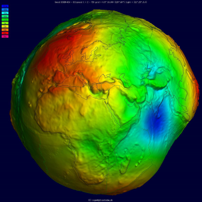

# Conceptos básicos de topografía, fotogrametría y fotointerpretación
Keywords: `Topography` `Photogrammetric`

  
  

 

El estudio de la topografía no permite entender la forma de la tierra y ...

## Objetivos

* Entender conceptos básicos de topografía y sus ramas derivadas.
* 

## Requerimientos

* Conceptos básicos de geografía.

## ¿Qué es la Topografía? [^1]

La topografía es una ciencia que estudia el conjunto de procedimientos para determinar las posiciones relativas de los puntos sobre la superficie de la tierra y debajo de la misma, mediante la combinación de las medidas según los tres elementos del espacio: 

* Distancia
* Elevación
* Dirección

La topografía explica los procedimientos y operaciones del trabajo de campo, los métodos de cálculo o procesamiento de datos y la representación del terreno en un plano o dibujo topográfico a escala. La combinación de estos elementos se denomina Levantamiento topográfico.

## Ramas principales de la topografía

### A.Geodesia

 Tomado de: <a href="https://commons.wikimedia.org/wiki/File:Geoid_undulation_10k_scale.jpg">https://commons.wikimedia.org</a>  

## Actividades complementarias:pencil2:

En la siguiente tabla se listan las actividades complementarias que deben ser desarrolladas y documentadas por el estudiante en un único archivo de Adobe Acrobat .pdf. El documento debe incluir portada (mostrar nombre completo, código y enlace a su cuenta de GitHub), numeración de páginas, tabla de contenido, lista de tablas, lista de ilustraciones, introducción, objetivo general, capítulos por cada ítem solicitado, conclusiones y referencias bibliográficas.

| Actividad | Alcance |
|:---------:|:--------|
|     1     | ....    | 

## Compatibilidad

* Esta actividad puede ser desarrollada con cualquier software SIG que disponga de herramientas para de digitalización con opciones de encajado o snapping.
* 

## Referencias

* 

## Control de versiones

| Versión    | Descripción     | Autor                                      | Horas |
|------------|:----------------|--------------------------------------------|:-----:|
| 2022.07.20 | Versión inicial | [rcfdtools](https://github.com/rcfdtools)  |   0   |

_R.SIGE es de uso libre para fines académicos, conoce nuestra licencia, cláusulas, condiciones de uso y como referenciar los contenidos publicados en este repositorio, dando [clic aquí](LICENSE.md)._

_¡Encontraste útil este repositorio!, apoya su difusión marcando este repositorio con una ⭐ o síguenos dando clic en el botón Follow de [rcfdtools](https://github.com/rcfdtools) en GitHub._

| [Anterior](../xxxx) | [Inicio](../../README.md) | [:beginner: Ayuda / Colabora](https://github.com/rcfdtools/R.SIGE/discussions/99999) | [Siguiente]() |
|---------------------|-------------------|---------------------------------------------------------------------------|---------------|

[^1]: www.ecomexico.net