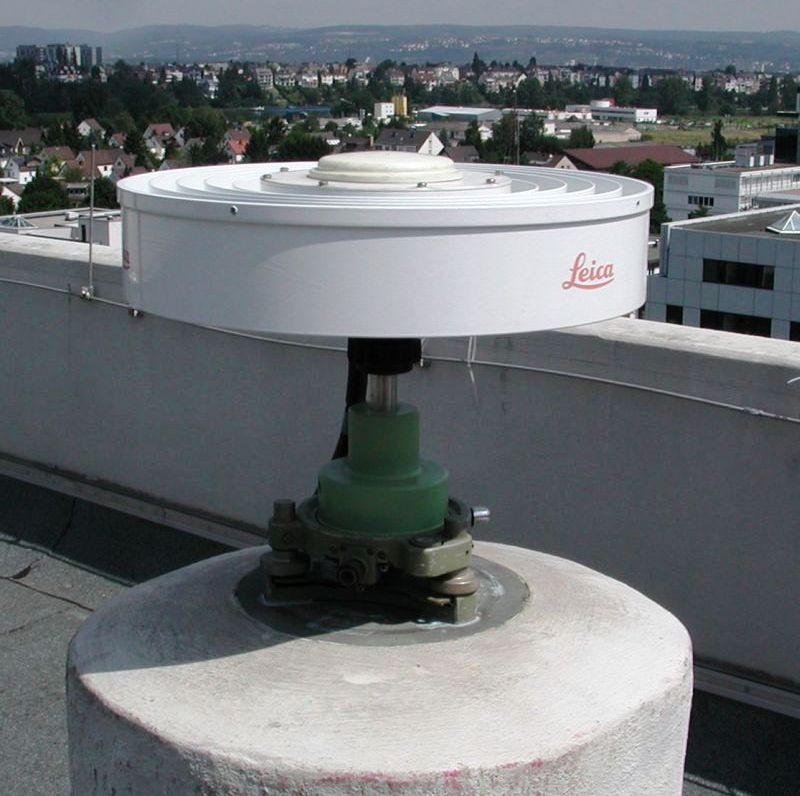
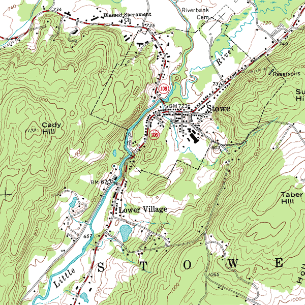
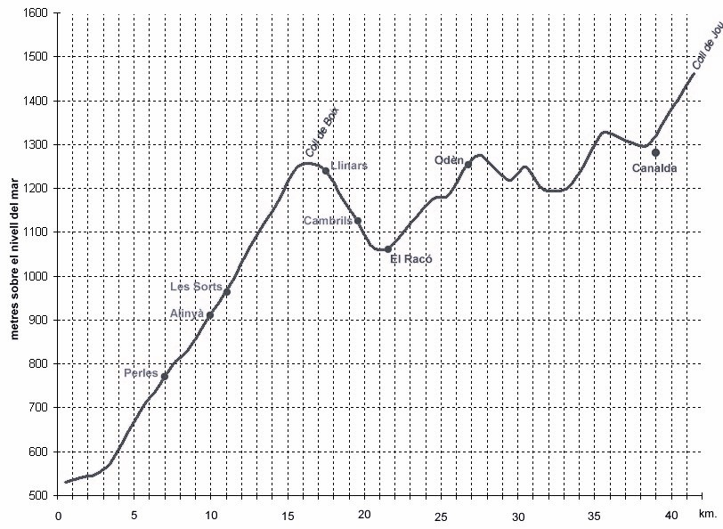

# Conceptos básicos de topografía, fotogrametría y fotointerpretación
Keywords: `Topography` `Photogrammetric` `Earth-Shape` `GNSS`

La topografía se trata de la medición de las características físicas o geométricas de la Tierra. Los levantamientos topográficos se clasifican a menudo por el tipo de datos estudiados o por los instrumentos o métodos utilizados. Algunos ejemplos son los estudios geodésicos, geológicos, topográficos, hidrográficos, terrestres, geofísicos, de suelos, de minas y de ingeniería.[^1]

 Tomado de: <a href="Public Domain, https://commons.wikimedia.org/w/index.php?curid=479365">https://commons.wikimedia.org</a>  

## Objetivos

* Entender conceptos básicos de topografía y sus ramas derivadas.
* Entender su aplicación y utilidad.
* Entender las diferencias entre planimetría y altimetría. 

## Requerimientos

* Lectura - [Resolución de problemas con un enfoque geográfico](https://www.esri.com/es-es/geographic-approach/overview).
* Lectura - [Geografía y Gobierno](https://www.esri.com/es-es/geographic-approach/case-studies/government).

## ¿Qué es la Topografía?[^2]

La topografía es una ciencia que estudia el conjunto de procedimientos para determinar las posiciones relativas de los puntos sobre la superficie de la tierra y debajo de la misma, mediante la combinación de las medidas según los tres elementos del espacio: 

| Elemento                                                                                   | Descripción                                                                                                                                                                                                                                                                                                                                                                                                                                                                                                                                                                         |
|:-------------------------------------------------------------------------------------------|:------------------------------------------------------------------------------------------------------------------------------------------------------------------------------------------------------------------------------------------------------------------------------------------------------------------------------------------------------------------------------------------------------------------------------------------------------------------------------------------------------------------------------------------------------------------------------------|
| [Distancia](https://es.wikipedia.org/wiki/Distancia)                                       | En las matemáticas, la distancia entre dos puntos del espacio euclídeo equivale a la longitud del segmento de la recta que los une, expresado numéricamente. En espacios más complejos, como los definidos en la geometría no euclidiana, el _camino más corto_ entre dos puntos es un segmento recto con curvatura llamada geodésica.                                                                                                                                                                                                                                              |
| [Elevación](https://es.wikipedia.org/wiki/Elevaci%C3%B3n_(ubicaci%C3%B3n_geogr%C3%A1fica)) | La elevación de una ubicación geográfica es la altura por encima o por debajo de un punto de referencia fijo, más comúnmente una referencia geoide, un modelo matemático del nivel del mar de la Tierra como una superficie equipotencial. El término elevación se usa principalmente cuando se hace referencia a puntos en la superficie de la Tierra, mientras que la altitud o la altura geopotencial se usa para puntos sobre la superficie, como la de un avión en vuelo o la de una nave espacial en órbita, y la profundidad se utiliza para puntos debajo de la superficie. |
| [Dirección](https://es.wikipedia.org/wiki/Direcci%C3%B3n_(geometr%C3%ADa))                 | Una dirección es la información contenida en la posición relativa de un punto respecto a otro punto sin información sobre la distancia. Las direcciones pueden ser o bien relativas respecto a una referencia determinada, o bien absolutas de acuerdo con algún marco de referencia previamente acordado.                                                                                                                                                                                                                                                                          |

> La topografía explica los procedimientos y operaciones del trabajo de campo, los métodos de cálculo o procesamiento de datos y la representación del terreno en un plano o dibujo topográfico a escala. La combinación de estos elementos se denomina Levantamiento topográfico.

Las 3 ramas principales de la topografía son la geodesía, la fotogrametría y la topografía plana. Tenga en cuenta que la definición de estas ramas puede variar de un autor a otro y que estas han sido utilizadas para ilustrar esta actividad.

## A. Geodesia[^2]

Trata de las mediciones de grandes extensiones de terreno, por ejemplo, para crear la carta geográfica de un país, para establecer fronteras y límites internos, para la determinación de líneas de navegación en ríos y lagos, etc. Estos levantamientos tienen en cuenta la verdadera forma de la tierra y requieren de gran precisión. 

 Tomado de: <a href="https://commons.wikimedia.org/wiki/File:Geoid_undulation_10k_scale.jpg">https://commons.wikimedia.org</a>  

Cuando la zona no es demasiado extensa, se puede obtener la precisión requerida considerando la tierra como una esfera perfecta, pero si dicha superficie es muy grande debe adoptarse la verdadera forma elipsoidal de la superficie terrestre.

 Tomado de: <a href="https://commons.wikimedia.org/wiki/File:WGS84_mean_Earth_radius.svg">https://commons.wikimedia.org</a>  

### Red geodésica de control

Los levantamientos de grandes ciudades se hacen bajo el supuesto de que la tierra es perfectamente esférica. Este tipo de levantamiento está catalogado como de alta precisión e incluye el establecimiento de los puntos de control primario o puntos geodésicos, que son puntos debidamente materializados sobre la superficie de la tierra, es decir, con posiciones y elevaciones conocidas, las cuales son de gran importancia y trascendencia por constituir puntos o redes de apoyo y referencia confiables para todos los demás levantamientos de menor precisión. Los puntos fijados geodésicamente (levantamiento de control), como por ejemplo los vértices de triangulación, constituyen una red a la que puede referirse cualquier otro levantamiento sin temor a error alguno en distancias horizontal o vertical o en dirección, derivado de la diferencia entre la superficie de referencia y la verdadera superficie de la tierra. 

 Tomado de: <a href="https://commons.wikimedia.org/wiki/File:%C3%9Cbersicht_der_Stationen.PNG">https://commons.wikimedia.org</a>  

### Sistema global de navegación por satélite - GNSS[^3]

Los sistemas de navegación por satélite transmiten información de geolocalización altamente precisa a los dispositivos y receptores [GNSS](https://es.wikipedia.org/wiki/Sistema_global_de_navegaci%C3%B3n_por_sat%C3%A9lite) para determinar su ubicación actual, tales como [GPS](https://es.wikipedia.org/wiki/GPS), [GLONASS](https://es.wikipedia.org/wiki/GLONASS), [Galileo](https://es.wikipedia.org/wiki/Galileo_(navegaci%C3%B3n_por_sat%C3%A9lite)), [QZSS](https://es.wikipedia.org/wiki/Quasi-Zenith), [BeiDou](https://es.wikipedia.org/wiki/Beidou) y [NavIC](https://en.wikipedia.org/wiki/Indian_Regional_Navigation_Satellite_System).

 Tomado de: <a href="https://commons.wikimedia.org/wiki/File:%D0%97%D0%B9%D0%BE%D0%BC%D0%BA%D0%B0_%D0%B2%D0%B0%D0%BB%D1%96%D0%B2_%D0%91%D1%96%D0%BB%D1%8C%D1%81%D1%8C%D0%BA%D0%BE%D0%B3%D0%BE_%D0%B3%D0%BE%D1%80%D0%BE%D0%B4%D0%B8%D1%89%D0%B0_(%D0%9F%D0%BE%D0%BE%D0%BB%D1%82%D0%B0%D0%B2%D1%89%D0%B8%D0%BD%D0%B0)_%D0%B2%D0%B8%D1%81%D0%BE%D0%BA%D0%BE%D1%82%D0%BE%D1%87%D0%BD%D0%B8%D0%BC_GNSS-%D0%BF%D1%80%D0%B8%D0%B9%D0%BC%D0%B0%D1%87%D0%B5%D0%BC.jpg">https://commons.wikimedia.org</a>  

GNSS significa Sistema global de navegación por satélite y se utiliza para describir cualquier sistema de navegación por satélite con cobertura global. Los sistemas de navegación por satélite transmiten información de geolocalización altamente precisa a los dispositivos y receptores GNSS para determinar su ubicación actual.

> En la mayoría de partes del mundo, es habitual hacer referencia a la navegación global como GPS (Sistema de posicionamiento global). En la práctica, el GPS es un sistema especial basado en Norteamérica. Hay un número creciente de sistemas de navegación por satélite disponibles para el público internacional. Se recomienda utilizar el término GNSS para describir todos los sistemas, ya que es el término más representativo internacionalmente.

 Tomado de: <a href="www.swisstopo.admin.ch">www.swisstopo.admin.ch</a>  

 Ejemplo de una estación de referencia GNSS Tomado de: <a href="https://commons.wikimedia.org/wiki/File:DGPS_Reference_Station.jpg">https://commons.wikimedia.org</a>  

## B. Fotogrametría[^2]

Es la disciplina que utiliza las fotografías para la obtención de mapas de terrenos. 

 Tomado de: <a href="https://commons.wikimedia.org/wiki/File:PIA21210_-_Satellite_Radar_Show_Complex_Set_of_Faults_Moved_in_2016_New_Zealand_Earthquake.jpg">https://commons.wikimedia.org</a>  

Los levantamientos fotogramétricos comprenden la obtención de datos y mediciones precisas a partir de fotografías del terreno tomadas con cámaras especiales u otros instrumentos sensores, ya sea desde aviones o drones (fotogrametría aérea) o desde puntos elevados del terreno (fotogrametría terrestre) y que tiene aplicación en trabajos topográficos. Se utilizan los principios de la perspectiva para la proyección sobre planos a escala, de los detalles que figuran en las fotografías. Los trabajos fotogramétricos deben apoyarse sobre puntos visibles y localizados por métodos de triangulación topográfica o geodésicos que sirven de control tanto planimétrico como altimétrico.

 Tomado de: <a href="https://visualdrone.co/">https://visualdrone.co/</a>  

> El trabajo consiste en esencia en tomar fotografías desde dos o más estaciones adecuadas y utilizarlas después para obtener los detalles del terreno fotografiado, tanto en planta como en alzado o perfil. 

### Fotointerpretación

Como una derivación de la fotogrametría, está la fotointerpretación que se emplea para el análisis cualitativo de los terrenos. La fotogrametría aérea se basa en fotografías tomadas desde aviones o drones equipados para el trabajo, en combinación de las técnicas de aerotriangulación analítica para establecer posiciones de control para la obtención de proyecciones reales del terreno y para hacer comprobaciones con una menor precisión que la obtenida en las redes primarias de control geodésico. 

> Tienen las ventajas de la rapidez con que se hace el trabajo, la profusión de los detalles y su empleo en lugares de difícil o imposible acceso desde el propio terreno.

 NVDI index Tomado de: <a href="https://eightfourcapital.medium.com/why-we-use-ndvi-a0d5172e6e6">https://eightfourcapital.medium.com</a>  

## C. Topografía plana

El levantamiento topográfico plano tiene la misma finalidad de los levantamientos geodésicos, pero difiere en cuanto a la magnitud y precisión y por consiguiente en los métodos empleados.

 Ejemplo de un mapa topográfico Tomado de: <a href="https://commons.wikimedia.org/wiki/File:Topographic_map_example.png">https://commons.wikimedia.org</a>  

Esta área se encarga de la medición de terrenos y lotes o parcelas de áreas pequeñas, proyectados sobre un plano horizontal, despreciando los efectos de la curvatura terrestre. La mayor parte de los levantamientos en proyectos de ingeniería son de esta clase, ya que los errores cometidos al no tener en cuenta la curvatura terrestre son despreciables y el grado de precisión obtenido queda dentro de los márgenes permisibles desde el punto de vista práctico.

 NVDI index Tomado de: <a href="https://commons.wikimedia.org/wiki/File:Geodeziistoj_de_kompanio_%22Gazprom_projektirovanije%22_plenumas_konkursajn_taskojn_de_elekta_etapo_de_la_3-a_konstrua_%C4%89ampionado_de_Rusio_07.jpg">https://commons.wikimedia.org</a>  

La mayor parte de los levantamientos de la topografía tienen por finalidad el cálculo de la superficie o áreas, volúmenes, distancias, direcciones y la representación de las medidas tomadas en el campo mediante los planos topográficos correspondientes.

 Plano topográfico Tomado de: <a href="https://lhongtortai.com/collection/que-es-un-plano-topografico">https://lhongtortai.com</a>  

Estos planos se utilizan como base para la mayoría de los trabajos y proyectos de ingeniería relacionados con la planeación y construcción de obras civiles. Por ejemplo, se requieren levantamientos topográficos antes, durante y después de la planeación y construcción de:

* Carreteras
* Vías férreas
* Sistemas de transporte masivo
* Edificios
* Puentes
* Túneles
* Canales
* Obras de irrigación
* Presas
* Sistemas de drenaje
* Subdivisión de terrenos urbanos y rurales
* Sistemas de aprovisionamiento de agua potable (acueductos)
* Redes de aguas servidas (alcantarillados)
* Oleoductos y gasoductos
* Líneas de transmisión eléctrica
* Control de la aerofotografía
* Determinación de límites de terrenos de propiedad privada y pública (linderos y medianeras)
* Actividades relacionadas con geología, arquitectura del paisaje, arqueología, etc.

## Estudio de la topografía[^2]

### A. Planimetría o control horizontal

Solo tiene en cuenta la proyección del terreno sobre un plano horizontal imaginario (vista en planta) que se supone que es la superficie media de la tierra; esta proyección se denomina base productiva y es la que se considera cuando se miden distancias horizontales y se calcula el área de un terreno. Aquí no interesan las diferencias relativas de las elevaciones entre los diferentes puntos del terreno. La ubicación de los diferentes puntos sobre la superficie de la tierra se hace mediante la medición de ángulos y distancias a partir de puntos y líneas de referencia proyectadas sobre un plano horizontal.

#### Poligonal abierta o cerrada

 Poligonal abierta Tomado de: <a href="https://bdigital.uniquindio.edu.co/bitstream/handle/001/5932/Capitulo%206%20poligonales.pdf">https://bdigital.uniquindio.edu.co/</a>  

El conjunto de líneas que unen los puntos observados se denomina Poligonal Base y es la que conforma la red fundamental o esqueleto del levantamiento, a partir de la cual se referencia la posición de todos los detalles o accidentes naturales y/o artificiales de interés. La poligonal base puede ser abierta o cerrada según los requerimientos del levantamiento topográfico. Como resultado de los trabajos de planimetría se obtiene un esquema horizontal.

 Poligonal cerrada Tomado de: <a href="https://bdigital.uniquindio.edu.co/bitstream/handle/001/5932/Capitulo%206%20poligonales.pdf">https://bdigital.uniquindio.edu.co/</a>  

#### Redes poligonales y ramificadas

En algunos trabajos de gran extensión es recomendable establecer una red de polígonos dentro de una poligonal cerrada, para así tener una forma de acceder a lugares en los cuales se requiere tomar información que no puede ser vista desde las estaciones perimetrales de la poligonal.

 Poligonal ramificada Tomado de: <a href="https://bdigital.uniquindio.edu.co/bitstream/handle/001/5932/Capitulo%206%20poligonales.pdf">https://bdigital.uniquindio.edu.co</a>  

### B. Altimetría o control vertical

La altimetría se encarga de la medición de las diferencias de nivel o de elevación entre los diferentes puntos del terreno, las cuales representan las distancias verticales medidas a partir de un plano horizontal de referencia. La determinación de las alturas o distancias verticales también se puede hacer a partir de las mediciones de las pendientes o grado de inclinación del terreno y de la distancia inclinada entre cada dos puntos. Como resultado se obtiene el esquema vertical.

 Perfil vial Tomado de: <a href="https://commons.wikimedia.org/wiki/File:Perfil_L-401.jpg">https://commons.wikimedia.org</a>  

### Planimetría y altimetría simultáneas

La combinación de las dos áreas de la topografía plana permite la elaboración o confección de un "plano topográfico", donde se muestra tanto la posición en planta como la elevación de cada uno de los diferentes puntos del terreno. La elevación o altitud de los diferentes puntos del terreno se representa mediante las curvas de nivel, que son líneas trazadas en el plano de planta con base en el esquema horizontal y que unen puntos que tienen igual altura. Las curvas de nivel sirven para reproducir en el dibujo la configuración topográfica o relieve del terreno.

 Impresión 3D Tomado de: <a href="https://opentopography.org/learn/3D_printing">https://opentopography.org</a>  

## Referencias

* https://globalgpssystems.com/gnss/gnss-constellations-how-they-work-and-how-they-improve-gps
* https://pro.arcgis.com/es/pro-app/latest/help/mapping/device-location/gnss-and-location-devices.htm
* https://bdigital.uniquindio.edu.co/bitstream/handle/001/5932/Capitulo%206%20poligonales.pdf

## Control de versiones

| Versión    | Descripción     | Autor                                      | Horas |
|------------|:----------------|--------------------------------------------|:-----:|
| 2024.01.20 | Versión inicial | [rcfdtools](https://github.com/rcfdtools)  |   6   |

_R.SIGE es de uso libre para fines académicos, conoce nuestra licencia, cláusulas, condiciones de uso y como referenciar los contenidos publicados en este repositorio, dando [clic aquí](LICENSE.md)._

_¡Encontraste útil este repositorio!, apoya su difusión marcando este repositorio con una ⭐ o síguenos dando clic en el botón Follow de [rcfdtools](https://github.com/rcfdtools) en GitHub._

| [:arrow_backward: Anterior](../xxxx) | [:house: Inicio](../../README.md) | [:beginner: Ayuda / Colabora](https://github.com/rcfdtools/R.SIGE/discussions/2) | [Siguiente :arrow_forward:](../GISBasic/Readme.md) |
|--------------------------------------|-----------------------------------|----------------------------------------------------------------------------------|----------------------------------------------------|

[^1]: https://support.esri.com/es-es/gis-dictionary/surveying
[^2]: https://www.ecomexico.net/
[^3]: https://pro.arcgis.com/es/pro-app/latest/help/mapping/device-location/gnss-and-location-devices.htm